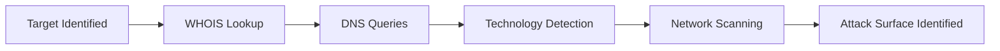
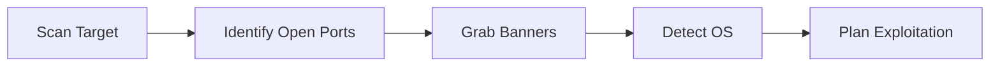

# Unit - 5

## 1. Information Security

### 1.1 Network Penetration Testing

#### 1.1.1 Definition of Penetration Testing

Network penetration testing (pentesting) is a **security assessment technique** in which a system, network, or application is **intentionally tested by simulating real-world attacks** to identify vulnerabilities.

* It involves:
  * attempting to exploit weaknesses
  * identifying security flaws
* Conducted in a **controlled and authorized manner**
* Helps understand how an attacker could compromise a system

***

#### 1.1.2 Purpose of Penetration Testing

* To identify **security vulnerabilities** before attackers do
* To evaluate the **effectiveness of security controls**
* To test:
  * firewalls
  * intrusion detection systems
  * authentication mechanisms
* Helps organizations:
  * strengthen defenses
  * reduce risk of cyber attacks
  * improve overall security posture

***

#### 1.1.3 Goals (Identify vulnerabilities, simulate attacks, improve security)

* **Identify Vulnerabilities**
  * Detect weaknesses in:
    * network configurations
    * operating systems
    * applications
  * Includes:
    * missing patches
    * insecure settings
* **Simulate Real-World Attacks**
  * Mimics techniques used by attackers:
    * scanning
    * exploitation
    * privilege escalation
  * Helps understand potential attack paths


* **Improve Security**
  * Provides recommendations to fix vulnerabilities
  * Helps in:
    * patch management
    * system hardening
    * policy improvements

***

### 🔐 Key Points (Exam Ready)

* Penetration testing = **authorized simulated attack**
* Focuses on:
  * identifying vulnerabilities
  * testing defenses
  * improving security
* Combines:
  * automated tools
  * manual techniques

***

## 2. Steps for Network Penetration Testing

### 2.1 Planning and Preparation

#### 2.1.1 Define Objectives

* Clearly define the **goals of the penetration test**.
* Objectives may include:
  * identifying vulnerabilities
  * testing security controls
  * evaluating incident response
* Helps determine:
  * scope of testing
  * systems to be tested
  * depth of analysis

***

#### 2.1.2 Gather Information

* Collect basic information about the target:
  * network architecture
  * IP ranges
  * domain details
* Sources:
  * public records
  * organizational data
  * technical documentation
* Helps in building a **testing strategy**.

***

#### 2.1.3 Obtain Permissions

* Ensure **legal authorization** before testing.
* Define:
  * scope of engagement
  * allowed techniques
  * time duration
* Important to avoid:
  * legal issues
  * unintended system damage

***

### 2.2 Reconnaissance

#### 2.2.1 Passive Reconnaissance

* Collect information **without directly interacting** with the target.
* Methods:
  * searching public databases
  * social media analysis
  * DNS records lookup
* No risk of detection.

***

#### 2.2.2 Active Reconnaissance

* Directly interacts with the target system.
* Methods:
  * network scanning
  * port scanning
  * service detection
* Higher accuracy but may be detected.

***

#### 2.2.3 Tools Used (WHOIS, Netcraft, Shodan, NSLOOKUP, Wappalyzer)

* **WHOIS**
  * provides domain registration details
* **Netcraft**
  * identifies hosting and technologies
* **Shodan**
  * search engine for internet-connected devices
* **NSLOOKUP**
  * retrieves DNS information
* **Wappalyzer**
  * detects technologies used by websites

***

### 2.3 Vulnerability Analysis

#### 2.3.1 Automated Scanning

* Uses tools to detect vulnerabilities:
  * Nessus
  * OpenVAS
* Identifies:
  * known vulnerabilities
  * misconfigurations
* Fast and efficient.

***

#### 2.3.2 Manual Analysis

* Security expert analyzes results manually.
* Helps:
  * verify findings
  * reduce false positives
  * discover complex vulnerabilities

***

### 2.4 Exploitation

#### 2.4.1 Exploiting Vulnerabilities

* Attempt to **exploit identified weaknesses**.
* Examples:
  * SQL injection
  * buffer overflow
  * password attacks
* Goal:
  * gain unauthorized access

***

#### 2.4.2 Privilege Escalation

* After gaining access, attacker tries to:
  * increase access level
  * gain administrative control
* Techniques:
  * exploiting system flaws
  * misconfigured permissions

***

### 2.5 Post-Exploitation

#### 2.5.1 Maintaining Access

* Attacker ensures continued access to system.
* Methods:
  * backdoors
  * persistence mechanisms
* Used to:
  * monitor system
  * perform further actions

***

#### 2.5.2 Pivoting Across Network

* Moving from one compromised system to others.
* Helps:
  * expand attack scope
  * access internal systems


***

### 2.6 Documentation and Reporting

#### 2.6.1 Recording Findings

* Document all discovered vulnerabilities.
* Includes:
  * vulnerability details
  * affected systems
  * severity levels

***

#### 2.6.2 Preparing Reports

* Create structured reports for stakeholders.
* Includes:
  * executive summary
  * technical details
  * recommendations

***

### 2.7 Follow-Up

#### 2.7.1 Fix Verification

* After fixes are applied:
  * re-test systems
  * verify vulnerabilities are resolved

***

#### 2.7.2 Security Improvements

* Implement long-term improvements:
  * patch management
  * policy updates
  * employee training

***

### 🔄 Overall Penetration Testing Process


***

### 🔐 Key Points (Exam Ready)

* Penetration testing is a **structured process**
* Key phases:
  * planning
  * recon
  * analysis
  * exploitation
  * reporting
* Final step (follow-up) ensures:
  * vulnerabilities are fixed
  * security is improved

***

## 3. Reconnaissance Tools and Techniques

### 3.1 WHOIS

#### 3.1.1 Definition

WHOIS is a protocol and tool used to **retrieve information about domain names and IP addresses**.

* Provides publicly available registration details.
* Used in reconnaissance to gather **initial target information**.

***

#### 3.1.2 Role of ICANN

* ICANN manages domain name registrations globally.
* Responsible for:
  * allocating domain names
  * maintaining WHOIS databases
* Ensures:
  * uniqueness of domain names
  * proper record keeping

***

#### 3.1.3 Domain Information Gathering

* WHOIS provides:
  * domain owner details
  * registration date
  * expiry date
  * registrar information
  * contact details
* Useful for:
  * identifying target organization
  * gathering attack surface information

***

### 3.2 NSLOOKUP

#### 3.2.1 Definition

NSLOOKUP is a command-line tool used to **query DNS servers** and obtain domain-related information.

* Available in most operating systems.
* Used for DNS troubleshooting and reconnaissance.

***

#### 3.2.2 DNS Query Function

* Queries DNS servers to retrieve:
  * IP addresses
  * mail servers (MX records)
  * name servers (NS records)
* Helps understand DNS structure of a target.

***

#### 3.2.3 Mapping Domain to IP

* Converts domain names into IP addresses.

Example:

```bash
nslookup example.com
```

* Output shows:
  * resolved IP address
  * DNS server used

***

### 3.3 Wappalyzer

#### 3.3.1 Definition

Wappalyzer is a tool used to **identify technologies used by websites**.

* Available as:
  * browser extension
  * web tool

***

#### 3.3.2 Technology Detection

* Detects:
  * web servers (Apache, Nginx)
  * frameworks (React, Angular)
  * CMS (WordPress, Joomla)
  * analytics tools
* Helps identify **technology stack** of target.

***

#### 3.3.3 Use in Reconnaissance

* Allows attacker to:
  * identify vulnerabilities in specific technologies
  * choose targeted exploits
* Example:
  * detecting outdated CMS → known vulnerabilities

***

### 3.4 Nmap / Zenmap

#### 3.4.1 Definition

Nmap is a powerful tool used for **network discovery and security auditing**.\
Zenmap is the GUI version of Nmap.

***

#### 3.4.2 Host Discovery

* Identifies active devices on the network.

Example:

```bash
nmap -sn 192.168.1.0/24
```

* Shows which hosts are **online**.

***

#### 3.4.3 Service Detection

* Detects open ports and running services.

Example:

```bash
nmap -sV target_ip
```

* Provides:
  * service name
  * version information

***

#### 3.4.4 OS Fingerprinting

* Identifies operating system of target.

Example:

```bash
nmap -O target_ip
```

* Helps attackers tailor exploits.

***

### 3.5 Angry IP Scanner

#### 3.5.1 Definition

Angry IP Scanner is a fast and lightweight tool used to **scan IP addresses and ports**.

* Open-source and cross-platform.

***

#### 3.5.2 IP and Port Scanning

* Scans:
  * IP ranges
  * open ports
* Provides:
  * active hosts
  * hostname
  * MAC address

***

#### 3.5.3 Use Cases

* Network administrators:
  * monitor network devices
* Security analysts:
  * identify open ports
  * detect vulnerabilities

***

### 🔄 Reconnaissance Workflow



***

### 🔐 Key Points (Exam Ready)

* Reconnaissance = **information gathering phase**
* Tools used:
  * WHOIS → domain info
  * NSLOOKUP → DNS data
  * Wappalyzer → technology stack
  * Nmap → network scanning
  * Angry IP Scanner → IP/port scanning
* Helps in:
  * identifying targets
  * planning attacks
  * discovering vulnerabilities

***

## 4. Banner Grabbing and OS Detection

### 4.1 Banner Grabbing

#### 4.1.1 Definition

Banner grabbing is a technique used to **collect information about a system or service** by analyzing the banner (response message) returned by a server.

* A banner may include:
  * software name
  * version number
  * operating system details
* Helps identify what is running on a target system.

***

#### 4.1.2 Purpose

* To gather **service and system information**.
* Helps attackers or testers:
  * identify software versions
  * detect outdated or vulnerable services
* Used for:
  * vulnerability assessment
  * penetration testing

***

#### 4.1.3 Tools (Telnet, Nmap, Netcat)

* **Telnet**
  * Connects to a remote service and displays banner.

```bash
telnet example.com 80
```

***

* **Nmap**
  * Performs banner grabbing using service detection.

```bash
nmap -sV target_ip
```

***

* **Netcat (nc)**
  * Reads banner information from services.

```bash
nc target_ip 80
```

***

### 4.2 Open Port and Service Identification

#### 4.2.1 Importance of Open Ports

* Open ports indicate **active services** running on a system.
* Examples:
  * Port 80 → HTTP
  * Port 443 → HTTPS
  * Port 22 → SSH
* Helps identify:
  * available services
  * potential vulnerabilities

***

#### 4.2.2 Entry Points for Attack

* Open ports act as **entry points** into a system.
* If a service is:
  * outdated
  * misconfigured

→ it can be exploited.

* Example:
  * open FTP port with weak credentials


***

### 4.3 OS Detection

#### 4.3.1 Identifying Operating System

* OS detection identifies the **operating system of the target machine**.
* Methods:
  * analyzing network responses
  * examining TCP/IP stack behavior
* Tools:
  * Nmap (`-O` option)

```bash
nmap -O target_ip
```

* Output may include:
  * OS type (Linux, Windows)
  * version details

***

#### 4.3.2 Targeted Exploitation

* Knowing the OS allows attackers to:
  * select appropriate exploits
  * target specific vulnerabilities
* Example:
  * Windows system → exploit SMB vulnerability
  * Linux system → exploit SSH misconfiguration

***

### 🔄 Combined Workflow



***

### 🔐 Key Points (Exam Ready)

* Banner grabbing reveals:
  * service name
  * version
* Open ports indicate:
  * running services
  * possible vulnerabilities
* OS detection helps:
  * tailor attacks
  * improve testing accuracy

***

### 🔐 Prevention Measures

* Disable unnecessary services
* Close unused ports
* Use firewalls
* Hide or modify banners
* Regularly update software

***
