# Unit - 4

## 1. Deadlocks

***

### 1.1 Introduction to Deadlocks

Deadlock is one of the most critical problems in Operating Systems, especially in **multiprogramming and concurrent environments** where multiple processes compete for limited resources.

When processes are not properly synchronized, they may end up waiting indefinitely, causing the system to halt progress.

***

#### 1.1.1 Definition of Deadlock

A **Deadlock** is a condition in which:

> A set of processes are blocked because each process is holding at least one resource and waiting for another resource that is held by another process in the set.

From your PPT and PDF:

* A process enters a **waiting state** if a requested resource is unavailable
* If this waiting continues **indefinitely**, the system is in **deadlock**

**Key Points:**

* No process can proceed
* Resources are locked
* System performance degrades or halts

***

#### 1.1.2 Multiprogramming Environment

In a **multiprogramming system**:

* Multiple processes execute concurrently
* Processes compete for:
  * CPU
  * Memory
  * I/O devices
  * Files

**Why Deadlocks Occur Here:**

* Resources are **limited**
* Processes execute **independently**
* No guaranteed order of execution
* OS allocates resources dynamically

**Execution Flow:**

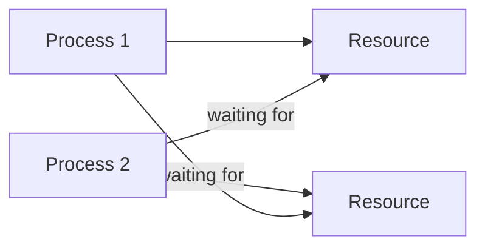

👉 This circular dependency leads to **deadlock**

***

#### 1.1.3 Waiting State and Resource Contention

**Waiting State**

A process enters a **waiting (blocked) state** when:

* It requests a resource
* The resource is currently unavailable

**Resource Contention**

Occurs when:

* Multiple processes request the **same resource simultaneously**

**Problem:**

* If processes keep waiting for each other → **deadlock**

**Example:**

* Process P1 holds Resource R1, waiting for R2
* Process P2 holds Resource R2, waiting for R1

👉 Neither can proceed

***

### 1.2 Example of Deadlock

***

#### 1.2.1 Bridge Crossing Problem

This is a **classic example** from your PPT.

**Scenario:**

* A narrow bridge allows traffic from **all four directions**
* Each section of the bridge is treated as a **resource**

**Situation:**

* Cars enter the bridge from all directions
* Each car occupies a section
* No car can move forward because another car blocks the path

**Visualization:**

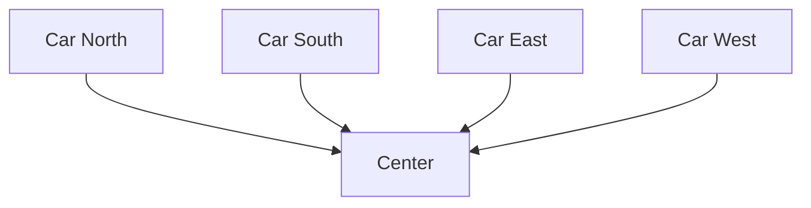

👉 All cars are stuck → **Deadlock**

**Resolution:**

* One or more cars must **back up (pre-emption)**
* Otherwise, system remains stuck forever

***

#### 1.2.2 Real-life Analogy

Deadlock situations occur in real life too:

**Examples:**

1. **Traffic Jam**
   * Vehicles block each other in a circular path
2. **Dining Table Problem**
   * People holding forks and waiting for others
3. **File Locking in Systems**
   * Two programs locking files and waiting for each other

**Simplified Example:**

* Person A has Book 1, needs Book 2
* Person B has Book 2, needs Book 1

👉 Both wait forever → Deadlock

***

#### 1.2.3 Starvation Possibility

Deadlock can also lead to **starvation** (important exam point).

**Starvation:**

> A condition where a process waits indefinitely because resources are continuously allocated to other processes.

**In Bridge Example:**

* Some cars may **never get a chance to move**
* Even if deadlock is resolved, some processes may still **never execute**

**Key Difference:**

| Concept    | Meaning                            |
| ---------- | ---------------------------------- |
| Deadlock   | All processes stuck                |
| Starvation | Some processes never get resources |

***

### 🔥 Important Exam Insights

* Deadlock = **circular waiting + no progress**
* Happens mainly in **resource sharing systems**
* Requires:
  * Multiple processes
  * Limited resources
  * Improper allocation
* Real-world examples are often asked (bridge, traffic, etc.)

***

## 2. System Model

The **System Model** describes how processes interact with resources in an operating system. It explains the **lifecycle of resource usage**, which is crucial to understanding how deadlocks occur.

In a multiprogramming system:

* Processes need resources to execute
* Resources are limited
* Improper handling of resources can lead to **deadlock**

***

### 2.1 Resource Usage Model

Every process follows a **three-step cycle** while using resources:

1. Request → 2. Use → 3. Release

This is the **core model** from your PPT and PDF.

***

#### 🔁 Overall Flow


***

#### 2.1.1 Resource Request

A process must **request a resource** before using it.

**Key Points:**

* Request is made via:
  * System calls
  * OS resource manager
* If resource is:
  * ✅ Available → granted immediately
  * ❌ Not available → process enters **waiting state**

**Example:**

```c
// Requesting a resource (pseudo)
request(R1);
```

**Important Concept:**

* If multiple processes request the same resource → **contention occurs**

**Problem Case:**

* If processes keep requesting resources held by others → can lead to **deadlock**

***

#### 2.1.2 Resource Allocation

Once the resource is available, the OS **allocates it to the process**.

**Key Points:**

* Resource is assigned **exclusively or shared**
* Process enters **execution state**
* OS updates internal tables:
  * Allocation table
  * Resource availability

**Example:**

```c
// Resource allocated
use(R1);
```

**Types of Allocation:**

* **Exclusive Allocation** → only one process can use (e.g., printer)
* **Shared Allocation** → multiple processes can use (e.g., read-only file)

**Critical Issue:**

* If a process holds a resource and requests another → **hold & wait condition begins**

***

#### 2.1.3 Resource Release

After completing its task, a process must **release the resource**.

**Key Points:**

* Resource is returned to the system
* Becomes available for other processes
* OS updates resource status

**Example:**

```c
// Releasing resource
release(R1);
```

**Important Rule:**

> A process must release resources **after use**, otherwise system efficiency decreases

***

#### ⚠️ Problem if Not Released:

* Resource remains occupied
* Other processes wait
* Can lead to:
  * **Deadlock**
  * **Starvation**

***

### 🧠 Combined Example (Full Cycle)

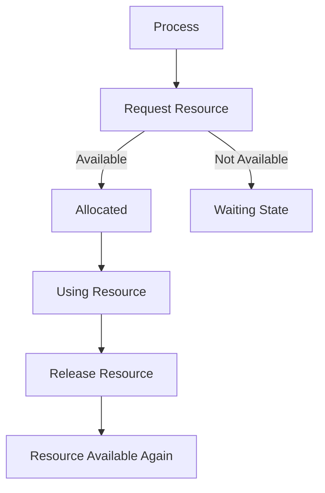

***

### 🔥 Important Exam Insights

* Every process follows:\
  👉 **Request → Allocate → Release**
* Deadlock occurs when:
  * Request is granted partially
  * Resources are not released
* This model is the **foundation** for:
  * Deadlock conditions
  * Banker’s Algorithm
  * Resource Allocation Graph

***

### ⚡ Key Observations

* Processes **must not hold resources indefinitely**
* OS must ensure:
  * Proper allocation
  * Fair scheduling
* Improper handling → **deadlock is inevitable**

***

## 3. Necessary Conditions for Deadlock

Deadlock occurs **only if all four conditions are true simultaneously**.\
These are called **necessary and sufficient conditions** (from your PPT + PDF).

> ❗ If **any one condition is removed → deadlock cannot occur**

***

### 🧠 Overview of All Conditions

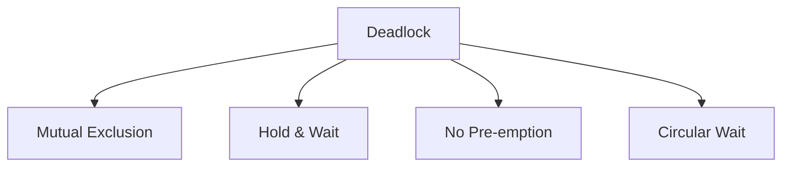

***

### 3.1 Mutual Exclusion

> At least one resource must be **non-shareable**, i.e., only one process can use it at a time.

***

#### 3.1.1 Non-shareable Resources

A resource is **non-shareable** if:

* Only one process can access it at a time
* Other processes must wait

**Why this causes deadlock:**

* If a process holds a resource exclusively
* Other processes cannot proceed → waiting begins

**Examples of non-shareable resources:**

* Printer
* CPU (in some cases)
* File locks
* I/O devices

***

#### 3.1.2 Examples (Printer, Devices)

**Example:**

* Process P1 is printing → holds printer
* Process P2 wants to print → must wait

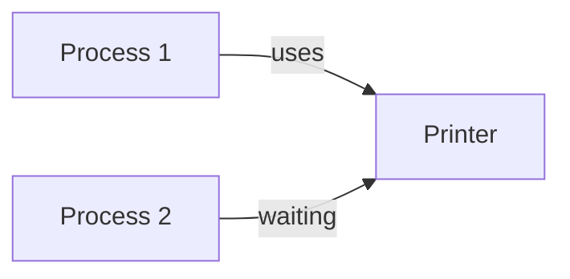

👉 This exclusive access creates the **first condition for deadlock**

***

### 3.2 Hold and Wait

> A process is holding at least one resource and waiting for additional resources held by other processes.

***

#### 3.2.1 Holding Resources While Waiting

**Situation:**

* Process P1 holds Resource R1
* P1 requests Resource R2 (held by P2)

**Key Idea:**

* Process does NOT release its current resource while waiting

***

#### 3.2.2 Resource Dependency

This creates **dependency between processes**

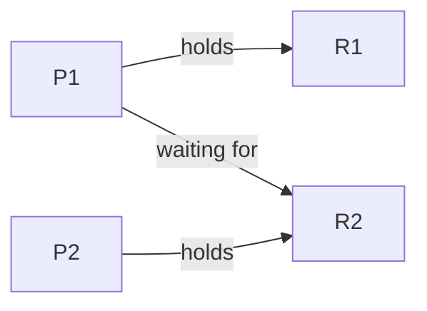

👉 P1 depends on P2 → dependency chain begins

**Why dangerous:**

* If all processes follow this → system gets stuck

***

### 3.3 No Pre-emption

> Resources cannot be forcibly taken away; they must be released voluntarily by the process.

***

#### 3.3.1 Voluntary Resource Release

* A process releases a resource **only after completing its task**
* OS cannot forcefully take it

**Example:**

```c
// Process holds resource until completion
use(resource);
release(resource); // voluntary
```

***

#### 3.3.2 Lack of Forceful Allocation

**Problem:**

* If a process is stuck, OS cannot:
  * Take its resource
  * Give it to another process

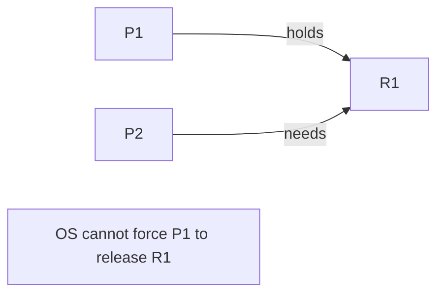

👉 This restriction allows deadlock to persist

***

### 3.4 Circular Wait

> A set of processes exist such that each process is waiting for a resource held by the next process in a circular chain.

***

#### 3.4.1 Circular Dependency Chain

**Structure:**

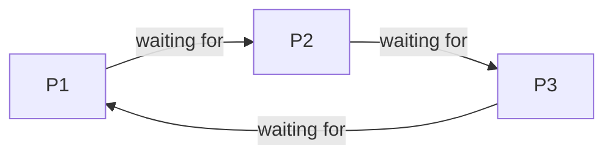

👉 Forms a **cycle**

***

#### 3.4.2 Process Waiting Cycle

**Real Example:**

* P1 holds R1 → needs R2
* P2 holds R2 → needs R3
* P3 holds R3 → needs R1

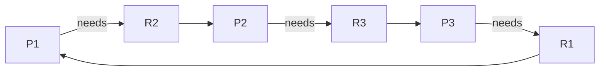

👉 This is a **deadlock cycle**

***

### 🔥 Final Summary (Very Important)

| Condition        | Meaning                | Why It Causes Deadlock   |
| ---------------- | ---------------------- | ------------------------ |
| Mutual Exclusion | Resource not shareable | Blocks other processes   |
| Hold & Wait      | Holding + waiting      | Creates dependency       |
| No Pre-emption   | Cannot take resources  | No recovery possible     |
| Circular Wait    | Cycle of processes     | System stuck permanently |

***

### 🎯 Key Exam Points

* All 4 conditions must exist **together**
* Removing ANY one condition prevents deadlock
* Most questions ask:
  * Define each condition
  * Give examples
  * Explain with diagram

***

### 💡 Memory Trick

👉 **M-H-N-C**

* M → Mutual Exclusion
* H → Hold & Wait
* N → No Pre-emption
* C → Circular Wait

***

## 4. Resource Allocation Graph (RAG)

A **Resource Allocation Graph (RAG)** is a graphical tool used to represent:

* Processes
* Resources
* Allocation and request relationships

It is widely used to **analyze and detect deadlocks** in a system.

***

### 🧠 Basic Idea

* Nodes represent **processes and resources**
* Edges represent **requests and allocations**

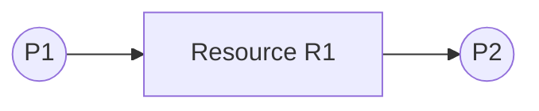

***

### 4.1 Components of RAG

***

#### 4.1.1 Processes (Pi)

* Represented as **circles**
* Denoted as:
  * P1, P2, P3, ..., Pn

**Meaning:**

* Each circle represents a **process in the system**


***

#### 4.1.2 Resources (Rj)

* Represented as **rectangles (boxes)**
* Denoted as:
  * R1, R2, R3, ..., Rn

**Meaning:**

* Each rectangle represents a **resource type**

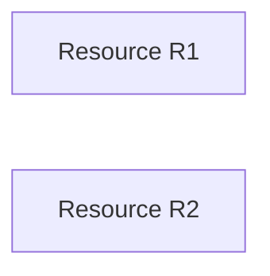

***

#### 4.1.3 Resource Instances

* A resource may have **multiple instances**
* Represented as **dots inside the resource box**

**Example:**

* R1 has 2 instances → shown as 2 dots


**Key Insight:**

* Important for determining:
  * **Guaranteed deadlock**
  * **Possible deadlock**

***

### 4.2 Edges in Graph

Edges define the **relationship between processes and resources**

***

#### 4.2.1 Request Edge (Process → Resource)

> A directed edge from process to resource

**Meaning:**

* Process is **requesting** a resource
* Process is in **waiting state**

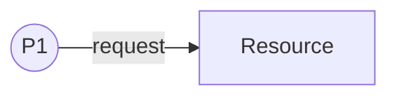

**Interpretation:**

* P1 wants R1 but does not have it yet

***

#### 4.2.2 Assignment Edge (Resource → Process)

> A directed edge from resource to process

**Meaning:**

* Resource is **allocated** to process
* Process is currently **holding the resource**

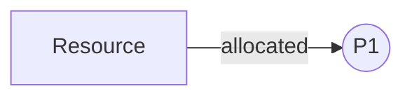

**Interpretation:**

* P1 is using R1

***

### 4.3 Graph Behavior

***

#### 4.3.1 Conversion of Request to Assignment Edge

**Process:**

1. Process requests resource → request edge
2. Resource becomes available
3. OS allocates resource → edge direction reverses

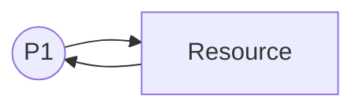

**Explanation:**

* Initially: P1 → R1 (request)
* After allocation: R1 → P1 (assignment)

***

#### 4.3.2 Directed Graph Nature

* RAG is a **directed graph**
* Direction of edges is **very important**

**Why?**

* Direction tells:
  * Who is waiting
  * Who is holding

**Important Rule:**

* Incorrect direction = wrong interpretation

***

### 4.4 Deadlock Detection using RAG

RAG is used to determine whether a system is in a **deadlock state**

***

#### 4.4.1 No Cycle → No Deadlock

> If there is **no cycle**, the system is **safe**

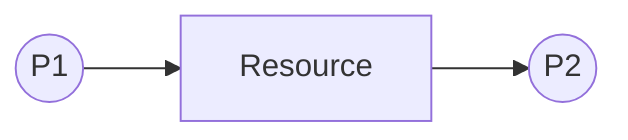

**Explanation:**

* No circular dependency
* Processes can complete

***

#### 4.4.2 Cycle with Single Instance → Deadlock

> If a cycle exists AND each resource has **only one instance** → **deadlock exists**

**Example:**

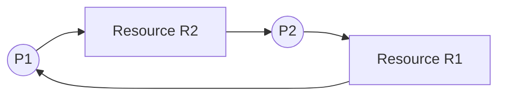

**Explanation:**

* P1 waiting for R2 (held by P2)
* P2 waiting for R1 (held by P1)

👉 Circular wait → **deadlock**

***

#### 4.4.3 Cycle with Multiple Instances → Possibility of Deadlock

> If a cycle exists AND resources have **multiple instances** → **deadlock may or may not occur**

**Example:**

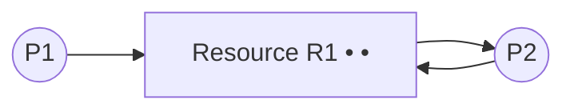

**Explanation:**

* Even though cycle exists:
  * Another instance may be available
  * Process may proceed

👉 So:

* Cycle ≠ guaranteed deadlock
* Only indicates **possibility**

***

### 🔥 Final Summary

| Case                       | Result            |
| -------------------------- | ----------------- |
| No cycle                   | No deadlock       |
| Cycle + single instance    | Deadlock          |
| Cycle + multiple instances | Possible deadlock |

***

### 🎯 Important Exam Points

* RAG is a **graphical representation**
* Two types of edges:
  * Request
  * Assignment
* Cycle detection is **key concept**
* Most common questions:
  * Draw RAG
  * Identify deadlock
  * Explain cycle condition

***

### 💡 Quick Memory Trick

👉 **RAG = Nodes + Edges + Cycle Check**

* Nodes → Process + Resource
* Edges → Request + Allocation
* Cycle → Deadlock indicator

***

