# Unit - 5

## 1. Memory Management Basics

***

### 1.1 Introduction to Memory Management

Memory Management is one of the **core functions of an Operating System**, responsible for managing and coordinating the use of **main memory (RAM)** among multiple processes.

***

#### 1.1.1 Definition of Memory Management

> Memory Management is the process of **controlling and coordinating computer memory**, assigning portions of memory to programs and ensuring efficient utilization.

**Key Points:**

* Manages allocation and deallocation of memory
* Keeps track of memory usage
* Ensures no process interferes with another

**From your PPT:**

* It is a **key characteristic of OS resource management**

***

#### 1.1.2 Role of OS in Resource Management

The OS acts as a **memory manager** and performs:

**1. Allocation**

* Assigns memory to processes when required

**2. Deallocation**

* Frees memory after process execution

**3. Protection**

* Prevents unauthorized access between processes

**4. Address Mapping**

* Converts logical → physical addresses

**5. Optimization**

* Ensures efficient memory usage

***

#### 🔁 OS Memory Handling Flow

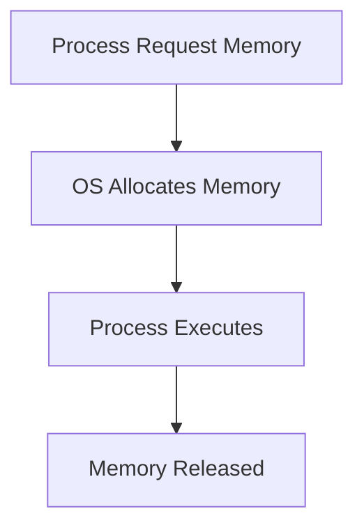

***

#### 1.1.3 Importance of Main Memory (RAM)

Main memory (RAM) is:

> The **primary working area** where programs are executed

**Key Points:**

* All active processes run in RAM
* Faster than secondary storage
* Limited in size → needs efficient management

**From PPT:**

* Most programs execute in **main memory**
* It is a **critical factor in system performance**

***

#### ⚠️ Why Memory Management is Important

* Prevents memory conflicts
* Enables multiprogramming
* Improves CPU utilization
* Avoids memory wastage

***

### 1.2 Memory Hierarchy

***

#### 1.2.1 Concept of Memory Hierarchy

> Memory hierarchy organizes different types of memory based on **speed, cost, and size**

**Goal:**

* Achieve **fast access + low cost**

***

#### 🔁 Memory Hierarchy Structure

```mermaid
flowchart TD
    A[Registers] --> B[Cache]
    B --> C[Main Memory (RAM)]
    C --> D[Secondary Storage (Disk)]
```

***

#### 1.2.2 Minimizing Access Time

Memory hierarchy is designed to:

> Reduce **average memory access time**

**How?**

* Frequently used data → stored in **faster memory (cache)**
* Less used data → stored in **slower memory (disk)**

**Concept Used:**

* **Locality of Reference** (important for later topics)

***

#### Example:

* CPU first checks:
  1. Cache
  2. RAM
  3. Disk

👉 This reduces delay

***

#### 1.2.3 Levels of Memory

| Level                   | Speed     | Cost    | Size     |
| ----------------------- | --------- | ------- | -------- |
| Registers               | Fastest   | Highest | Smallest |
| Cache                   | Very Fast | High    | Small    |
| Main Memory (RAM)       | Moderate  | Medium  | Medium   |
| Secondary Memory (Disk) | Slow      | Low     | Large    |

***

#### 🧠 Key Insight

* Higher level → faster, expensive, small
* Lower level → slower, cheaper, large

***

### 🔥 Final Summary

* Memory Management = **control + allocation of RAM**
* OS ensures:
  * Efficiency
  * Protection
  * Proper allocation
* Memory hierarchy balances:
  * **Speed vs Cost vs Size**

***

### 🎯 Important Exam Points

* Definition of memory management (must learn)
* Role of OS in memory
* Memory hierarchy diagram (very common)
* RAM importance

***

## 2. Addressing and Mapping

Addressing and mapping define **how a program’s addresses (generated by CPU)** are converted into **actual memory locations** where data resides.

This is essential because:

* Programs use **logical (virtual) addresses**
* Memory hardware uses **physical addresses**

***

### 2.1 Logical and Physical Address

***

#### 2.1.1 Logical Address (CPU Generated)

> A **logical address** (also called virtual address) is the address generated by the CPU during program execution.

**Key Points:**

* Generated by **user program**
* Exists in **logical address space**
* Not directly used by memory hardware

**Example:**

* CPU generates address like: `1000`

👉 This is **not the real memory location**

***

#### 2.1.2 Physical Address (Actual Memory Location)

> A **physical address** is the actual location in main memory (RAM)

**Key Points:**

* Used by **memory unit**
* Represents real memory location
* Obtained after **address translation**

**Example:**

* Logical → 1000
* Physical → 5420

***

#### 2.1.3 Logical vs Physical Address Space

| Feature         | Logical Address | Physical Address |
| --------------- | --------------- | ---------------- |
| Generated by    | CPU             | MMU              |
| Visible to user | Yes             | No               |
| Address space   | Logical space   | Physical space   |
| Usage           | Program view    | Memory view      |

***

#### 🔁 Address Translation Concept


***

### 2.2 Memory Management Unit (MMU)

***

#### 2.2.1 Address Translation Mechanism

> MMU is a hardware component that converts **logical addresses → physical addresses**

**Key Functions:**

* Maps virtual address to real address
* Ensures memory protection
* Supports relocation

***

#### 🔁 Translation Process

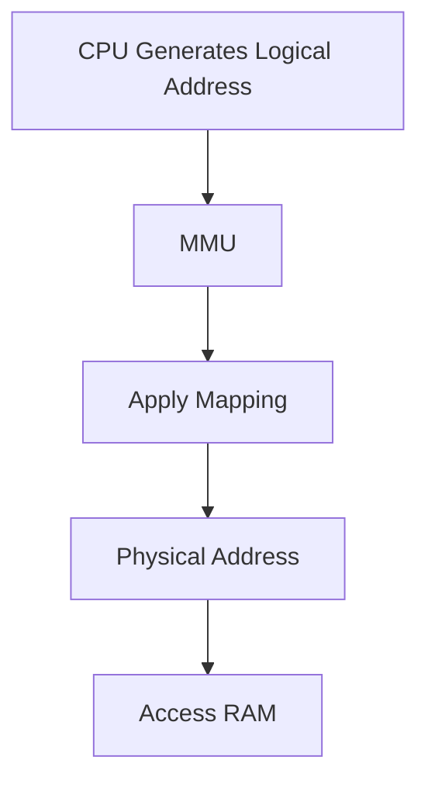

***

#### 2.2.2 Virtual to Physical Mapping

**Basic Mapping:**

```
Physical Address = Logical Address + Base Register
```

**Explanation:**

* Base register stores starting address
* Logical address is offset

**Example:**

```
Base = 5000
Logical = 200

Physical = 5200
```

***

### 🧠 Key Insight

* Program thinks memory starts at **0**
* But actually mapped to different location in RAM

***

### 2.3 Binding of Instructions and Data

> Binding = process of mapping **program addresses to memory addresses**

***

#### 2.3.1 Compile-Time Binding

**When?**

* During compilation

**Condition:**

* Memory location is known in advance

**Characteristics:**

* Generates **absolute code**
* Cannot change location later

**Problem:**

* No flexibility

***

#### 2.3.2 Load-Time Binding

**When?**

* During loading of program into memory

**Characteristics:**

* Generates **relocatable code**
* Can change starting address

**Advantage:**

* More flexible than compile-time

***

#### 2.3.3 Execution-Time Binding

**When?**

* During execution

**Characteristics:**

* Address translation happens **dynamically**
* Requires hardware support (MMU)

**Advantage:**

* Maximum flexibility
* Supports virtual memory

***

#### 🔁 Binding Comparison

| Type           | Time             | Flexibility |
| -------------- | ---------------- | ----------- |
| Compile-time   | Before execution | Low         |
| Load-time      | During loading   | Medium      |
| Execution-time | During execution | High        |

***

### 2.4 Types of Code

***

#### 2.4.1 Absolute Code

> Code with fixed memory addresses

**Features:**

* Cannot be relocated
* Used in compile-time binding

**Example:**

* Address hardcoded in program

***

#### 2.4.2 Relocatable Code

> Code that can be loaded at different memory locations

**Features:**

* Uses relative addressing
* Flexible
* Used in load-time & execution-time binding

***

### 2.5 Multistep Processing of User Program

***

#### 2.5.1 Compilation → Linking → Loading → Execution

This is the **complete lifecycle of a program**

***

#### 🔁 Step-by-Step Flow


***

#### 🔍 Step Explanation

**1. Compilation**

* Converts source code → object code

**2. Linking**

* Combines libraries + object files
* Produces executable

**3. Loading**

* Loads program into memory

**4. Execution**

* CPU starts executing instructions

***

### 🔥 Final Summary

* Logical address = **CPU generated**
* Physical address = **actual memory location**
* MMU performs **translation**
* Binding determines **when mapping happens**
* Program execution follows:\
  👉 Compile → Link → Load → Execute

***

### 🎯 Important Exam Points

* Logical vs Physical address (very common)
* MMU role
* Binding types (comparison asked frequently)
* Absolute vs Relocatable code
* Program execution steps diagram

***

## 3. Memory Management Requirements

For an operating system to manage memory efficiently and safely, it must satisfy certain **fundamental requirements**:

* Relocation
* Protection
* Address translation
* Hardware support

These ensure **flexibility, security, and correctness** in memory usage.

***

### 3.1 Relocation

> Relocation is the ability to **load and execute a program at any memory location**

***

#### 3.1.1 Dynamic Relocation

> Dynamic relocation allows a program to be moved during execution

**Key Idea:**

* Program is **not fixed** to a single memory location
* OS can:
  * Move processes in memory
  * Allocate memory dynamically

**Why needed?**

* Multiprogramming environment
* Efficient memory utilization

***

#### 🔁 Example

* Program assumes it starts at address `0`
* Actually loaded at address `5000`

👉 All addresses must be **adjusted dynamically**

***

#### 3.1.2 Address Translation at Runtime

> Address translation is performed **during execution** using hardware (MMU)

**Process:**


**Formula:**

```
Physical Address = Base Register + Logical Address
```

**Benefit:**

* Program can run **anywhere in memory**
* No need to modify program code

***

### 3.2 Protection

> Protection ensures that processes **do not access unauthorized memory**

***

#### 3.2.1 Memory Access Control

**OS Responsibilities:**

* Prevent one process from accessing another’s memory
* Prevent illegal memory access

**Types of violations:**

* Accessing another process memory
* Accessing OS memory
* Accessing invalid address

***

#### 🔁 Protection Check

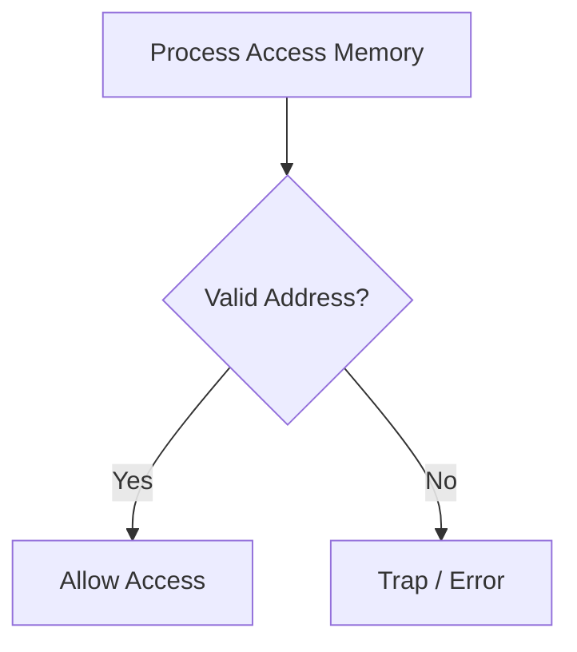

***

#### 3.2.2 Runtime Protection

> Protection checks are performed **during execution**

**How?**

* Every memory access is checked against:
  * Allowed range
* If invalid:
  * OS generates **trap (interrupt)**

**Benefit:**

* Ensures **system stability and security**

***

### 3.3 Base and Limit Registers

These are **hardware registers** used for:

* Address translation
* Protection

***

#### 3.3.1 Base Register

> Stores the **starting address** of the process in physical memory

**Function:**

* Added to logical address

**Example:**

```
Base = 4000
Logical = 200

Physical = 4200
```

***

#### 3.3.2 Limit Register

> Defines the **maximum size (range)** of the process

**Function:**

* Ensures process stays within its memory bounds

**Example:**

```
Limit = 1000
Logical Address must be < 1000
```

***

#### 3.3.3 Address Space Definition

Together, base and limit define:

> The **valid address space of a process**

***

#### 🔁 Working of Base & Limit Registers

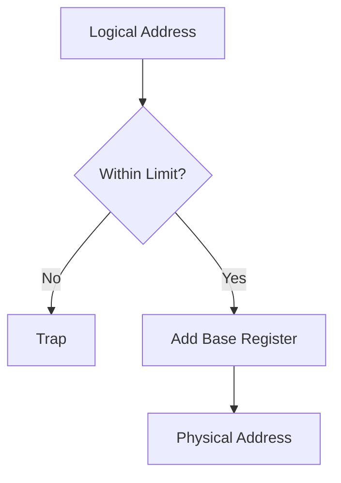

***

### 🧠 Key Insight

* Base → where process starts
* Limit → how far it can go

👉 Together → ensure **safe execution**

***

### 3.4 Hardware Address Protection

***

#### 3.4.1 Dynamic Relocation Mechanism

> Combines relocation + protection using hardware support

**Steps:**

1. CPU generates logical address
2. Check against limit register
3. Add base register
4. Generate physical address

***

#### 🔁 Complete Flow

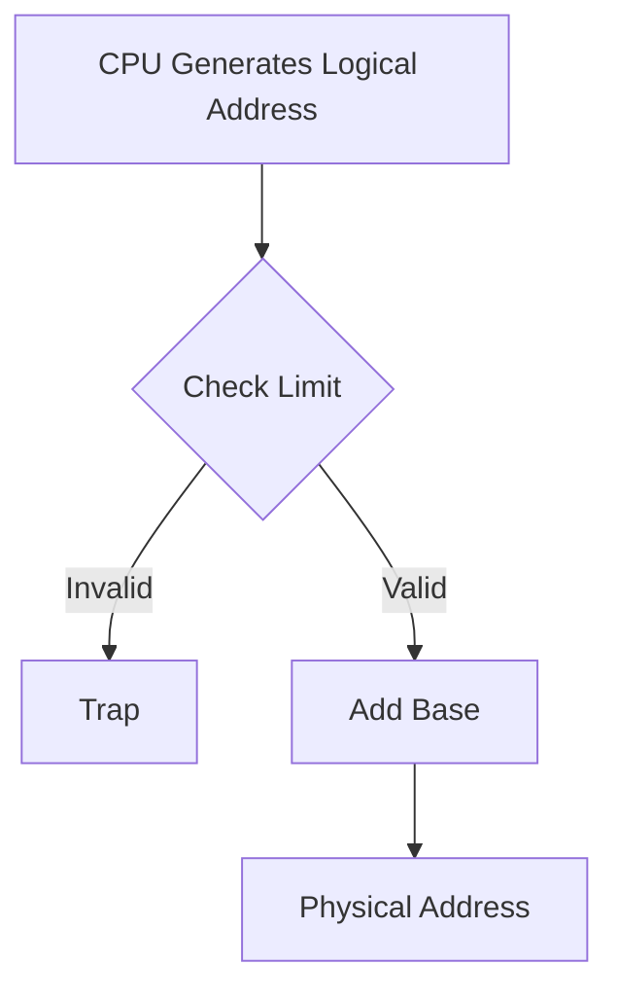

***

#### 3.4.2 Trap Handling

> A **trap** is generated when an illegal memory access occurs

***

**Causes of Trap:**

* Access beyond limit
* Access to protected memory
* Invalid address

***

**OS Action:**

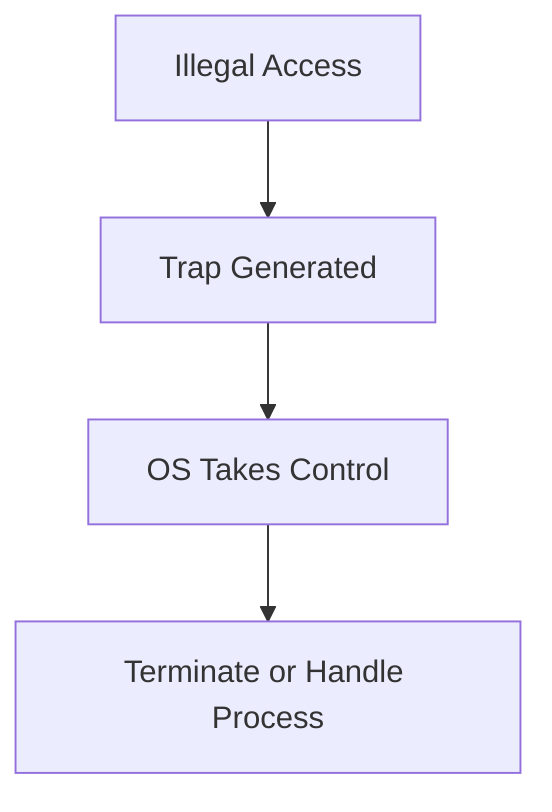

***

**Importance:**

* Prevents system crash
* Ensures security
* Maintains process isolation

***

### 🔥 Final Summary

| Requirement    | Purpose                         |
| -------------- | ------------------------------- |
| Relocation     | Flexibility in memory placement |
| Protection     | Prevent unauthorized access     |
| Base Register  | Starting address                |
| Limit Register | Maximum range                   |
| Trap           | Error handling mechanism        |

***

### 🎯 Important Exam Points

* Define relocation and protection
* Base & limit registers diagram (very important)
* Runtime address translation
* Trap concept (short question favorite)

***

### 💡 Memory Trick

👉 **R-P-B-L-T**

* R → Relocation
* P → Protection
* B → Base
* L → Limit
* T → Trap

***

## 4. Loading and Swapping

This section explains how programs are **brought into memory** and how processes are **moved between memory and disk** to optimize usage.

***

### 4.1 Static vs Dynamic Loading

> Loading refers to the process of **bringing a program into main memory for execution**

***

#### 4.1.1 Static Loading

> In static loading, the **entire program is loaded into memory before execution begins**

**Key Characteristics:**

* Whole program is loaded at once
* Execution starts only after complete loading
* Requires enough memory to hold entire program

**🔁 Flow**


**Advantages:**

* Simple to implement
* No runtime overhead

**Disadvantages:**

* Wastes memory
* Not suitable for large programs

***

#### 4.1.2 Dynamic Loading

> In dynamic loading, **only required parts of the program are loaded when needed**

**Key Idea:**

* Program is divided into modules
* Modules are loaded **on demand**

***

#### 🔁 Flow

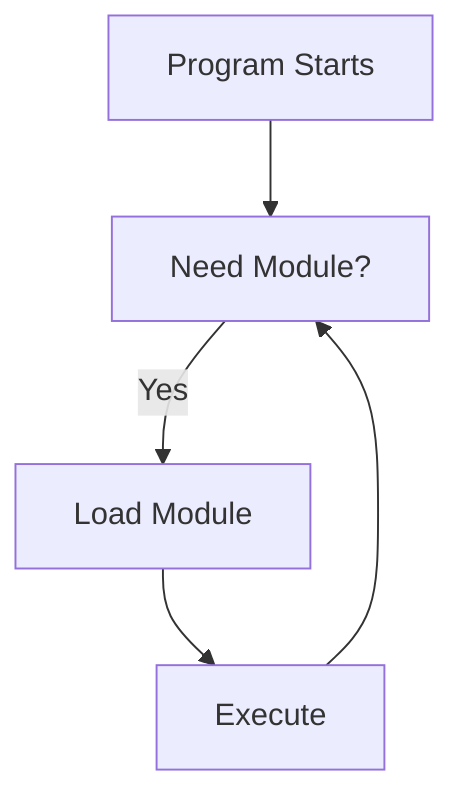

***

**Advantages:**

* Efficient memory usage
* Suitable for large programs
* Faster startup

**Disadvantages:**

* Slight overhead during execution
* Requires support for loading mechanism

***

#### 4.1.3 Static vs Dynamic Linking

Linking is the process of **combining program with libraries**

***

**🔹 Static Linking**

> Libraries are linked at compile time

**Features:**

* Library code becomes part of executable
* No need for external libraries at runtime

**Advantages:**

* Faster execution
* No dependency

**Disadvantages:**

* Larger program size
* Less flexible

***

**🔹 Dynamic Linking**

> Libraries are linked at runtime

**Features:**

* Uses shared libraries
* Linking happens during execution

**Advantages:**

* Smaller executable
* Shared memory usage

**Disadvantages:**

* Slight runtime overhead
* Dependency on external libraries

***

### 🧠 Comparison Table

| Feature      | Static Loading   | Dynamic Loading  |
| ------------ | ---------------- | ---------------- |
| Loading time | Before execution | During execution |
| Memory usage | High             | Efficient        |
| Flexibility  | Low              | High             |

***

### 4.2 Swapping

> Swapping is a technique of **moving processes between main memory and secondary storage**

***

#### 4.2.1 Concept of Swapping

**Definition:**

> Swapping temporarily transfers a process from **main memory to disk** and brings it back when needed

**Why needed?**

* Memory is limited
* Multiple processes need execution

***

#### 🔁 Swapping Process


***

#### 4.2.2 Backing Store

> Backing store is the **secondary storage (disk)** used to store swapped-out processes

**Characteristics:**

* High-speed disk
* Large storage capacity
* Stores inactive processes

**From PPT:**

* Also called **swap space**

***

#### 4.2.3 Roll-in / Roll-out

**🔹 Roll-out**

> Moving process from **memory → disk**

**🔹 Roll-in**

> Bringing process from **disk → memory**

***

#### 🔁 Flow

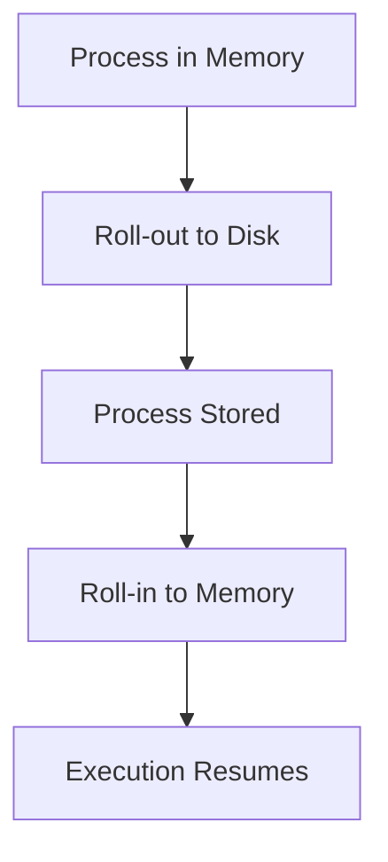

***

#### 4.2.4 Ready Queue Handling

When swapping occurs:

* Processes moved out → placed in **backing store**
* When brought back:
  * Added to **ready queue**

***

#### 🔁 Process Scheduling with Swapping

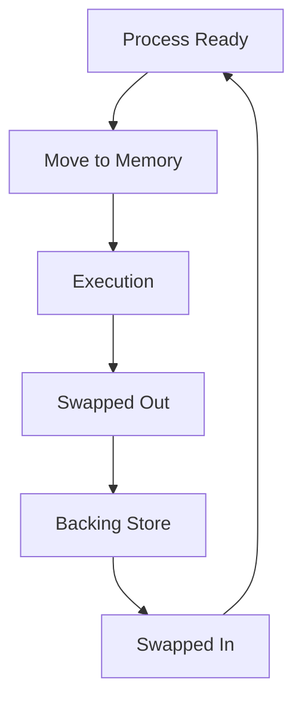

***

### 🔥 Final Summary

| Concept         | Meaning                            |
| --------------- | ---------------------------------- |
| Static Loading  | Load entire program                |
| Dynamic Loading | Load on demand                     |
| Static Linking  | Link at compile time               |
| Dynamic Linking | Link at runtime                    |
| Swapping        | Move process between RAM and disk  |
| Backing Store   | Disk storage for swapped processes |

***

### 🎯 Important Exam Points

* Static vs Dynamic loading (very common)
* Static vs Dynamic linking
* Swapping concept + roll-in/roll-out
* Backing store definition
* Diagrams are frequently asked

***

### 💡 Memory Trick

👉 **L-S-D-S**

* L → Loading
* S → Static
* D → Dynamic
* S → Swapping

***

## 5. Memory Allocation Techniques

Memory allocation techniques define **how memory is assigned to processes** in a system.\
The goal is to ensure **efficient utilization, minimal waste, and proper process execution**.

***

### 5.1 Memory Allocation Concept

***

#### 5.1.1 Definition

> Memory allocation is the process of **assigning portions of main memory to processes**

**Key Points:**

* Managed by OS
* Ensures processes get required memory
* Prevents memory conflicts

***

#### 5.1.2 Types of Allocation

There are two main types:

1. **Contiguous Allocation**
2. **Non-contiguous Allocation** (Paging, Segmentation — later topics)

***

### 5.2 Contiguous Memory Allocation

***

#### 5.2.1 Concept

> In contiguous allocation, each process is allocated a **single continuous block of memory**

**Key Idea:**

* Process must fit entirely in one block

***

#### 🔁 Visualization

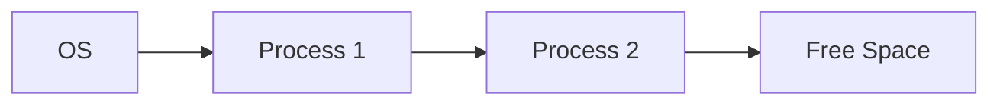

***

#### 5.2.2 Low Memory and High Memory

Memory is divided into:

**🔹 Low Memory**

* Reserved for OS
* Contains interrupt vectors, system code

**🔹 High Memory**

* Available for user processes

***

#### 🔁 Layout

```mermaid
flowchart TD
    A[Low Memory (OS)] --> B[High Memory (User Processes)]
```

***

### 5.3 Partitioning Techniques

To manage contiguous allocation, memory is divided into **partitions**

***

#### 5.3.1 Single Process Monitor

> Only one process is loaded in memory at a time

**Features:**

* OS occupies part of memory
* Remaining memory → one user process

**Limitation:**

* No multiprogramming
* CPU underutilized

***

#### 5.3.2 Multiprogramming with Fixed Partition (MFT)

> Memory is divided into **fixed-size partitions**

**Features:**

* Number of partitions is fixed
* One process per partition

***

#### 🔁 Diagram

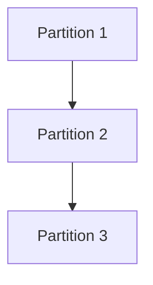

***

#### 5.3.3 Multiprogramming with Variable Partition (MVT)

> Memory is divided into **variable-sized partitions**

**Features:**

* Partition size depends on process size
* More flexible than MFT

***

### 5.4 Fixed Partition (MFT)

***

#### 5.4.1 Working

* Memory is divided into fixed blocks
* Each block holds one process
* If process is smaller → unused space remains

***

#### 🔁 Example

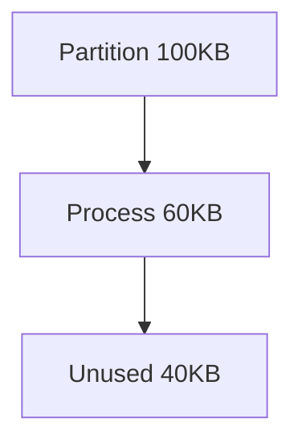

***

#### 5.4.2 Advantages

* Simple to implement
* Easy allocation

***

#### 5.4.3 Disadvantages

* **Internal Fragmentation**
* Limited number of processes
* Wastage of memory

***

### 5.5 Variable Partition (MVT)

***

#### 5.5.1 Dynamic Partitioning

* Memory allocated based on process size
* No fixed partition size

***

#### 🔁 Example

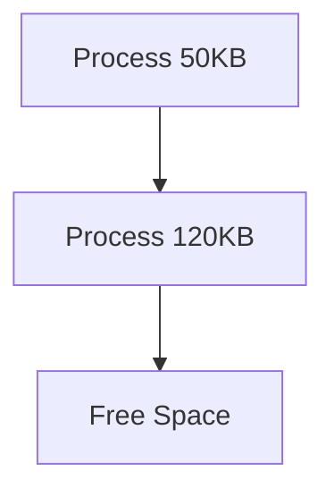

***

#### 5.5.2 Advantages

* Better memory utilization
* No internal fragmentation

***

#### 5.5.3 Disadvantages

* **External Fragmentation**
* Complex management
* Requires compaction

***

### 5.6 Fragmentation

> Fragmentation is the **wastage of memory due to inefficient allocation**

***

#### 5.6.1 Internal Fragmentation

> Wasted space **inside allocated memory block**

**Cause:**

* Fixed partition larger than process

**Example:**

```mermaid
flowchart TD
    A[Partition 100KB] --> B[Process 70KB]
    B --> C[Unused 30KB]
```

***

#### 5.6.2 External Fragmentation

> Free memory is scattered into small blocks and cannot be used effectively

**Cause:**

* Variable partitioning

***

#### 🔁 Example

```mermaid
flowchart TD
    A[Free 20KB] --> B[Process]
    B --> C[Free 30KB]
```

👉 Total free = 50KB but not contiguous

***

#### 5.6.3 Causes and Examples

| Type     | Cause              | Example            |
| -------- | ------------------ | ------------------ |
| Internal | Fixed partition    | Extra unused space |
| External | Variable partition | Scattered holes    |

***

### 5.7 Compaction

***

#### 5.7.1 Concept

> Compaction is the process of **shifting processes to combine free space into one block**

***

#### 🔁 Before & After

```mermaid
flowchart LR
    A[Free] --> B[Process] --> C[Free] --> D[Process]
```

➡ After compaction:

```mermaid
flowchart LR
    A[Process] --> B[Process] --> C[Large Free Block]
```

***

#### 5.7.2 Advantages

* Eliminates external fragmentation
* Creates large continuous memory block

***

#### 5.7.3 Limitations

* Time-consuming
* Requires relocation support
* High overhead

***

### 🔥 Final Summary

| Concept                | Key Idea             |
| ---------------------- | -------------------- |
| Contiguous Allocation  | Single memory block  |
| MFT                    | Fixed partitions     |
| MVT                    | Variable partitions  |
| Internal Fragmentation | Waste inside block   |
| External Fragmentation | Scattered free space |
| Compaction             | Combine free memory  |

***

### 🎯 Important Exam Points

* MFT vs MVT comparison (very common)
* Internal vs External fragmentation
* Compaction concept
* Contiguous allocation diagram

***

### 💡 Memory Trick

👉 **M-F-F-C**

* M → MFT
* F → Fragmentation
* F → Fixed/Variable
* C → Compaction

***

