# Unit - 6

## 1. I/O Systems (Explained Clearly)

This topic is about **how the CPU communicates with external devices** like keyboard, disk, printer, etc.\
Since devices are **slow compared to CPU**, special mechanisms are needed to manage I/O efficiently.

***

### 1.1 Introduction to I/O Systems

***

#### 1.1.1 Definition of I/O Devices

I/O devices are hardware components that allow:

* **Input** → data into the system (keyboard, mouse)
* **Output** → results from the system (monitor, printer)

👉 Without I/O devices, a computer cannot interact with users.

***

#### 1.1.2 Types of I/O Devices

I/O devices are classified based on their usage:

* **Human-readable devices** → keyboard, monitor
* **Machine-readable devices** → disk drives, sensors
* **Communication devices** → network cards

👉 This classification helps OS manage them differently.

***

#### 1.1.3 Block Devices vs Character Devices

This is a very important distinction:

* **Block devices**
  * Transfer data in chunks (blocks)
  * Support random access
  * Example: Hard disk
* **Character devices**
  * Transfer data one character at a time
  * Sequential access
  * Example: Keyboard

👉 OS treats them differently in drivers and buffering.

***

### 1.2 Device Controller

***

#### 1.2.1 Concept of Device Controller

A device controller is a **hardware unit that controls a specific device**.

👉 CPU does NOT directly talk to devices\
👉 It communicates through the **device controller**

***

#### 1.2.2 Components (Buffer, Registers)

* **Buffer** → Temporary storage for data transfer
* **Registers**:
  * Control register → command from CPU
  * Status register → device status
  * Data register → actual data

***

#### 1.2.3 Role as Interface between Device and OS

The controller:

* Receives instructions from OS
* Operates the device
* Transfers data between device and memory

👉 It acts like a **translator between CPU and hardware**

***

### 1.3 Device Drivers

***

#### 1.3.1 Definition

Device driver is **software that controls hardware devices**.

***

#### 1.3.2 Functions of Device Drivers

* Converts OS commands → device-specific instructions
* Controls device operations
* Handles interrupts

👉 Without drivers, OS cannot use hardware.

***

#### 1.3.3 Types of Drivers

* Block device drivers
* Character device drivers
* Network drivers

***

### 1.4 I/O Communication Techniques

***

#### 1.4.1 Memory-Mapped I/O

Device registers are treated like **memory locations**

👉 CPU uses normal memory instructions

✔ Simple\
❌ May reduce memory space

***

#### 1.4.2 Port-Mapped I/O

Devices have a **separate address space**

👉 Special instructions used

✔ Better separation\
❌ Slightly complex

***

### 1.5 Direct Memory Access (DMA)

***

#### 1.5.1 Concept of DMA

DMA allows data transfer **without CPU involvement**

👉 Device ↔ Memory directly

***

#### 1.5.2 Need for DMA

Without DMA:

* CPU handles every byte → slow

With DMA:

* Faster transfer
* CPU free for other work

***

#### 1.5.3 Working of DMA

Steps:

1. CPU initializes DMA controller
2. DMA takes control of bus
3. Transfers data between device and memory
4. Sends interrupt when done

👉 CPU is only involved at start and end

***

#### 1.5.4 DMA Modes

* **Burst Mode** → transfer entire block at once
* **Cycle Stealing** → transfer small chunks
* **Block Mode** → continuous transfer

***

### 1.6 I/O Methods

***

#### 1.6.1 Polling

CPU repeatedly checks:

> “Is device ready?”

❌ Waste of CPU time

***

#### 1.6.2 Interrupt-driven I/O

Device sends signal when ready

✔ Efficient\
✔ CPU not wasted

***

#### 1.6.3 Polling vs Interrupt

* Polling = CPU checks
* Interrupt = Device notifies

👉 Interrupt is better in real systems

***

### 1.7 Interrupt Handling

***

#### 1.7.1 Interrupt Concept

Interrupt is a signal that:

* Stops current execution
* Transfers control to ISR

***

#### 1.7.2 Types of Interrupts

* Hardware → from devices
* Software → from programs

***

#### 1.7.3 Interrupt Cycle

After each instruction:\
👉 CPU checks for interrupt

***

#### 1.7.4 Interrupt Vector

Stores address of ISR

***

#### 1.7.5 Interrupt Service Routine (ISR)

Code executed to handle interrupt

***

#### 1.7.6 Steps in Interrupt Handling

1. Interrupt occurs
2. CPU saves current state
3. Executes ISR
4. Restores state
5. Continues execution

***

#### 1.7.7 Return from Interrupt (IRET)

Special instruction used to:\
👉 Return back to normal program

***

### 1.8 Instruction Cycle with Interrupt

CPU cycle includes:

1. Fetch → get instruction
2. Execute → run instruction
3. Interrupt → check for interrupts

👉 This cycle repeats continuously

***

### 1.9 Device Types

***

#### 1.9.1 Dedicated Devices

* Used by only one process
* Example: Printer

***

#### 1.9.2 Shared Devices

* Used by multiple processes
* Example: Disk

***

### 1.10 Principles of I/O Software

***

#### 1.10.1 Device Independence

Same interface for all devices

***

#### 1.10.2 Error Handling

OS detects and handles device errors

***

#### 1.10.3 Uniform Naming

Devices are named consistently

***

### 1.11 Device Independent I/O Software

***

#### 1.11.1 Concept

Provides a **common interface for all devices**

***

#### 1.11.2 Functions

* Buffering
* Error handling
* Device allocation

***

#### 1.11.3 Buffering

Temporary storage for smooth data transfer

***

#### 1.11.4 Device Allocation

Assigns devices to processes

***

### 1.12 Buffering Techniques

***

#### 1.12.1 Single Buffering

* One buffer
* Simple but slower

***

#### 1.12.2 Double Buffering

* Two buffers
* Parallel processing

***

#### 1.12.3 Circular Buffering

* Multiple buffers in loop
* Efficient for continuous data

***

### 🔥 Final Understanding

* CPU is **fast**, devices are **slow**
* OS uses:
  * Controllers
  * Drivers
  * Interrupts
  * DMA
  * Buffering

👉 to make communication **efficient and smooth**

***

### 🎯 Most Important for Exam

* DMA working
* Polling vs Interrupt
* Interrupt handling steps
* Buffering types
* Device controller vs driver

***

### 💡 One-line Summary

👉 **I/O System = Efficient communication between CPU and external devices**

***

## 2. File System (Explained Clearly)

A File System is the part of the OS responsible for **storing, organizing, and managing files on storage devices (disk, SSD)**.

> It provides a **structured way to store and retrieve data**

***

### 🧠 Core Idea

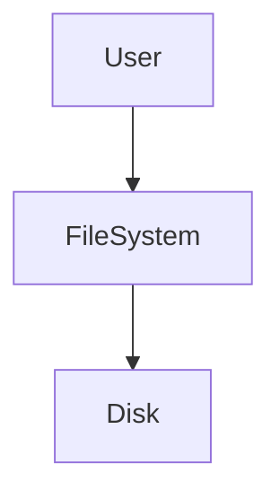

👉 User interacts with files → File system handles actual storage

***

### 2.1 File Concept

***

#### 2.1.1 Definition

> A file is a **collection of related data stored on secondary storage**

**Examples:**

* Text file (.txt)
* Program file (.c, .py)
* Image file (.jpg)

👉 Files are the **basic unit of storage**

***

#### 2.1.2 File Naming

Each file has a **unique name**

**Rules:**

* Consists of name + extension
* Example:
  * `notes.txt`
  * `program.c`

👉 Extension indicates file type

***

#### 2.1.3 File Types

Based on extension:

* `.txt` → Text
* `.exe` → Executable
* `.jpg` → Image

***

#### 2.1.4 Internal File Types

Based on content:

* **Text files** → human-readable
* **Source files** → program code
* **Object files** → compiled code
* **Executable files** → ready to run

***

### 2.2 File Attributes

***

#### 2.2.1 Name

* Human-readable file name

#### 2.2.2 Identifier

* Unique number assigned by OS

#### 2.2.3 Location

* Address of file on disk

#### 2.2.4 Size

* File size in bytes

#### 2.2.5 Protection

* Permissions (read, write, execute)

#### 2.2.6 Time & Date

* Creation, modification, access time

***

### 🧠 Insight

👉 Attributes = **metadata about file**

***

### 2.3 File Operations

***

#### 2.3.1 Create

* Create a new file

#### 2.3.2 Read

* Read data from file

#### 2.3.3 Write

* Write data into file

#### 2.3.4 Delete

* Remove file from system

#### 2.3.5 Open / Close

* Open → prepare file for use
* Close → release resources

#### 2.3.6 Rename

* Change file name

#### 2.3.7 Truncate

* Delete file content but keep file

***

#### 🔁 Flow


***

### 2.4 File Structure

***

#### 2.4.1 Byte Sequence

> File is treated as a sequence of bytes

* No structure
* Used in UNIX

***

#### 2.4.2 Record Structure

> File is divided into records

* Each record has fixed/variable size

***

#### 2.4.3 Tree Structure

> File organized hierarchically

* Used in databases

***

### 2.5 File Access Methods

***

#### 2.5.1 Sequential Access

> Data is accessed **in order**

**Example:**

* Reading file from start to end

✔ Simple\
❌ Slow for random access

***

#### 2.5.2 Direct Access

> Access data at any position

**Example:**

* Jump to record 50

✔ Fast\
✔ Flexible

***

#### 2.5.3 Indexed Access

> Uses index to locate data

**Example:**

* Index → points to records

✔ Efficient\
✔ Fast searching

***

### 2.6 File System Layered Structure

***

#### 🧠 Concept

File system is divided into layers for **modularity and efficiency**

***

#### 🔁 Layered Architecture

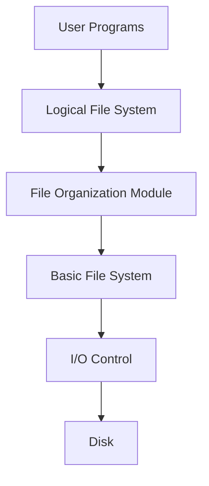

***

#### 2.6.1 Logical File System

* Handles:
  * File naming
  * File attributes
  * Directory structure

***

#### 2.6.2 File Organization Module

* Manages:
  * Allocation of files
  * Logical → physical mapping

***

#### 2.6.3 Basic File System

* Performs:
  * Read/write operations
  * Buffer management

***

#### 2.6.4 I/O Control

* Contains:
  * Device drivers
  * Interrupt handlers

***

### 🔥 Final Summary

| Concept        | Meaning              |
| -------------- | -------------------- |
| File           | Collection of data   |
| Attributes     | Metadata             |
| Operations     | Actions on file      |
| Access methods | How data is accessed |
| Layered FS     | Structured design    |

***

### 🎯 Important Exam Points

* File definition (very common)
* File attributes (short question)
* File operations (list-based question)
* Access methods comparison
* File system layers (diagram important)

***

### 💡 Memory Trick

👉 **F-A-O-A-L**

* F → File
* A → Attributes
* O → Operations
* A → Access
* L → Layers

***

## 3. Directory Structure (Explained Clearly)

A directory is used to **organize files** in a system.

> Just like folders in your computer, directories help **store and locate files efficiently**

***

### 🧠 Core Idea

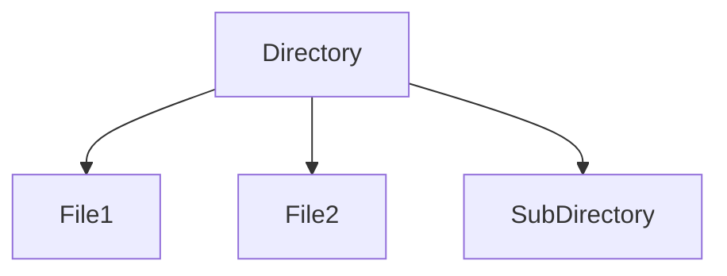

👉 Directory = **container of files and folders**

***

### 3.1 Directory Concept

***

#### 3.1.1 Definition

> A directory is a **special file that stores information about other files**

**It contains:**

* File names
* File locations
* File attributes

👉 It acts like an **index for files**

***

#### 3.1.2 Directory Operations

These are basic operations performed on directories:

***

**3.1.2.1 File Search**

* Locate a file in directory
* OS searches using file name

***

**3.1.2.2 File Creation**

* Add a new file entry
* Allocate space

***

**3.1.2.3 File Deletion**

* Remove file entry
* Free allocated space

***

**3.1.2.4 Listing**

* Display all files in directory

***

### 3.2 Directory Structures

Different ways to organize directories:

***

#### 3.2.1 Single Level Directory

> All files are stored in one directory

***

#### 🔁 Structure

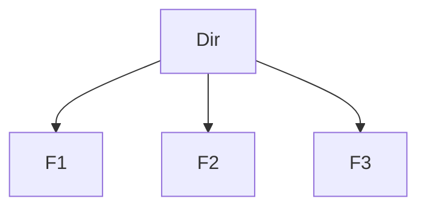

***

**Advantages:**

* Simple

**Disadvantages:**

* File name conflicts
* Not suitable for large systems

***

#### 3.2.2 Two Level Directory

> Separate directory for each user

***

#### 🔁 Structure

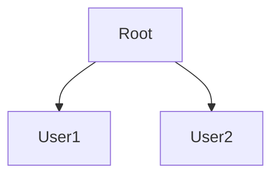

***

**Advantages:**

* No name conflict between users

**Disadvantages:**

* Limited sharing

***

#### 3.2.3 Tree Structure Directory

> Hierarchical structure (most common)

***

#### 🔁 Structure

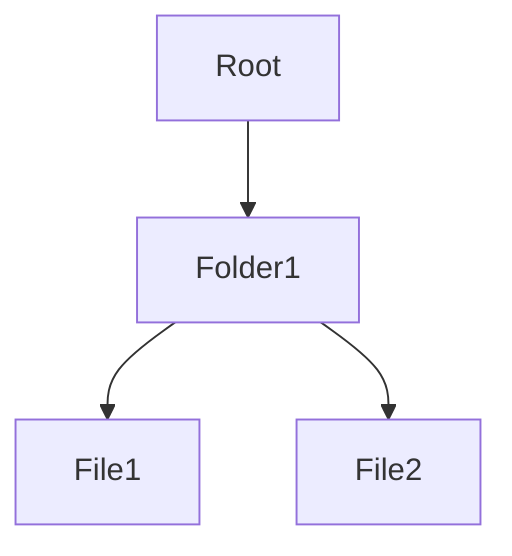

***

**Advantages:**

* Organized
* Easy navigation

***

#### 3.2.4 Acyclic Graph Directory

> Allows sharing of files/directories without cycles

***

#### 🔁 Structure

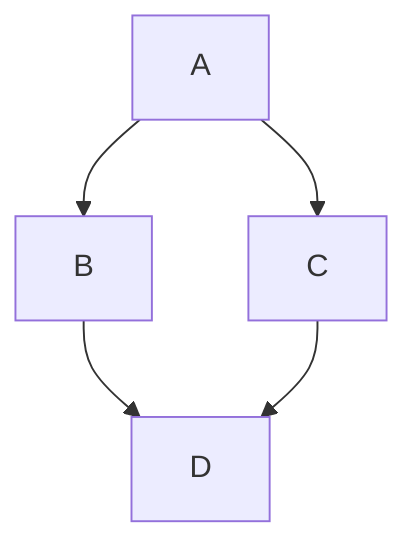

***

**Advantage:**

* File sharing

**Restriction:**

* No cycles allowed

***

#### 3.2.5 General Graph Directory

> Allows cycles (loops)

***

#### 🔁 Structure

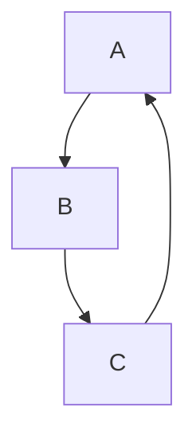

***

**Advantage:**

* Maximum flexibility

**Disadvantage:**

* Complex
* Risk of infinite loops

***

### 3.3 Path Names

***

#### 3.3.1 Absolute Path

> Full path from root directory

**Example:**

```
/home/user/file.txt
```

✔ Unique\
✔ Clear

***

#### 3.3.2 Relative Path

> Path relative to current directory

**Example:**

```
docs/file.txt
```

✔ Short\
✔ Convenient

***

### 🧠 Insight

* Absolute → starts from root
* Relative → starts from current location

***

### 3.4 Directory Implementation

***

#### 3.4.1 Linear List

> Directory stored as a simple list

**Features:**

* Easy to implement

**Disadvantages:**

* Slow search

***

#### 3.4.2 Hash Table

> Uses hashing for faster lookup

**Features:**

* Faster search

**Disadvantages:**

* Collision handling needed

***

### 🔥 Final Summary

| Concept        | Meaning                    |
| -------------- | -------------------------- |
| Directory      | Collection of file entries |
| Structure      | Organization method        |
| Path           | File location              |
| Implementation | How directory is stored    |

***

### 🎯 Important Exam Points

* Directory structures (very important)
* Tree vs Graph comparison
* Absolute vs Relative path
* Directory operations

***

### 💡 Memory Trick

👉 **S-T-A-G**

* S → Single level
* T → Two level
* A → Acyclic graph
* G → General graph

***

## 4. File Allocation Methods (Explained Clearly)

File allocation methods define **how files are stored on disk blocks**.

> OS must decide **where and how to place file data on disk**

***

### 🧠 Core Idea

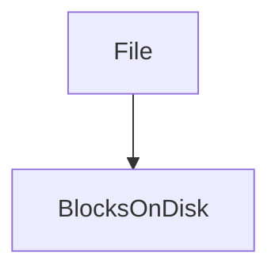

👉 A file is divided into **blocks**, and these blocks must be stored efficiently

***

### 4.1 Contiguous Allocation

***

#### 4.1.1 Concept

> File is stored in **continuous (adjacent) blocks** on disk

***

#### 🔁 Example

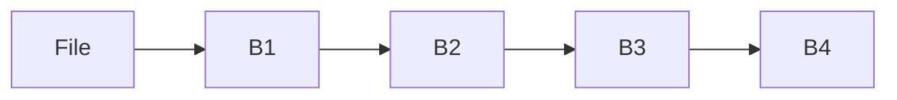

👉 All blocks are next to each other

***

#### How it works:

* Store:
  * Starting block
  * Length of file

***

#### 4.1.2 Advantages

* Fast access (both sequential & direct)
* Simple implementation
* Minimal disk seek time

***

#### 4.1.3 Disadvantages

* **External fragmentation**
* Difficult to expand file
* Requires large continuous space

***

### 4.2 Linked Allocation

***

#### 4.2.1 Concept

> File is stored as a **linked list of blocks**

Each block contains:

* Data
* Pointer to next block

***

#### 🔁 Example

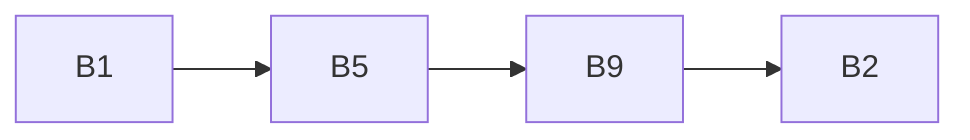

👉 Blocks are scattered but connected

***

#### 4.2.2 Advantages

* No external fragmentation
* Easy to grow file
* Flexible

***

#### 4.2.3 Disadvantages

* Slow access (must follow links)
* Pointer overhead
* Cannot support efficient random access

***

### 4.3 Indexed Allocation

***

#### 4.3.1 Concept

> Uses an **index block** to store addresses of all file blocks

***

#### 🔁 Structure

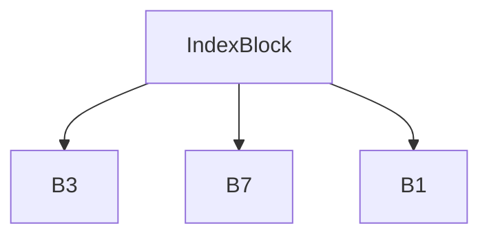

***

#### 4.3.2 Index Block

* Contains list of:
  * Block addresses

👉 OS directly accesses any block using index

***

#### 4.3.3 Advantages

* Supports direct access
* No external fragmentation
* Efficient for large files

***

#### 4.3.4 Disadvantages

* Extra memory for index block
* Overhead for small files
* Complex implementation

***

### 🔥 Final Comparison

| Method     | Storage      | Access | Fragmentation |
| ---------- | ------------ | ------ | ------------- |
| Contiguous | Continuous   | Fast   | External      |
| Linked     | Scattered    | Slow   | None          |
| Indexed    | Indexed list | Fast   | None          |

***

### 🎯 Important Exam Points

* Compare all 3 methods (very common)
* Advantages/disadvantages
* Diagrams (high scoring)
* Which method supports random access → Indexed

***

### 💡 Memory Trick

👉 **C-L-I**

* C → Contiguous
* L → Linked
* I → Indexed

***

### 🧠 Final Insight

* Contiguous → **fast but rigid**
* Linked → **flexible but slow**
* Indexed → **balanced (best practical)**

***

## 5. Free Space Management (Explained Clearly)

Free space management is about **keeping track of unused disk blocks**.

> OS must know which blocks are **free** so it can allocate them to new files

***

### 🧠 Core Idea

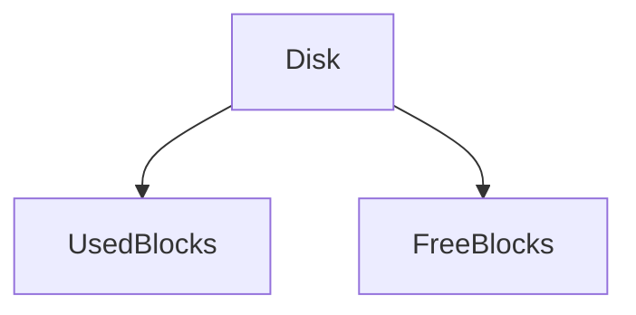

👉 OS maintains a structure to track **free blocks**

***

### 5.1 Bit Map (Bit Vector)

***

#### 5.1.1 Concept

> Each disk block is represented by a **bit (0 or 1)**

**Representation:**

* `0` → Free block
* `1` → Allocated block

***

#### 🔁 Example

```
Block No:   0 1 2 3 4 5 6 7
Bit Map:    1 0 1 1 0 0 1 0
```

👉 Free blocks = 1, 4, 5, 7

***

#### 5.1.2 Working

* OS scans bitmap
* Finds free block (bit = 0)
* Allocates it

***

#### Advantages:

* Simple
* Easy to find contiguous blocks

***

#### Disadvantages:

* Requires extra memory for bitmap
* Scanning can be slow for large disks

***

### 5.2 Linked List

***

#### 5.2.1 Concept

> Free blocks are linked together as a **linked list**

Each free block stores:

* Pointer to next free block

***

#### 🔁 Example

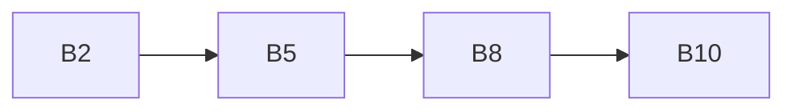

👉 These are free blocks

***

#### 5.2.2 Working

* OS keeps pointer to first free block
* Allocate → remove from list
* Free → add back to list

***

#### Advantages:

* No extra memory needed (stored in blocks)
* Simple

***

#### Disadvantages:

* Slow to find large contiguous blocks
* Sequential access only

***

### 5.3 Grouping Method

***

#### 5.3.1 Concept

> Instead of storing one pointer, a block stores **multiple free block addresses**

👉 Improves efficiency over linked list

***

#### 🔁 Structure

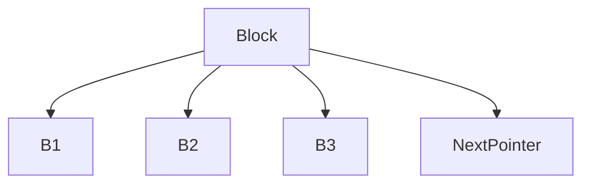

***

#### 5.3.2 Working

* First free block contains:
  * List of free blocks
  * Pointer to next group
* OS uses this list to allocate blocks quickly

***

#### Advantages:

* Faster than linked list
* Can allocate multiple blocks at once

***

#### Disadvantages:

* Slightly complex
* Extra management needed

***

### 🔥 Final Comparison

| Method      | Structure         | Speed  | Suitable For   |
| ----------- | ----------------- | ------ | -------------- |
| Bit Map     | Array of bits     | Medium | General use    |
| Linked List | Chain of blocks   | Slow   | Simple systems |
| Grouping    | Block of pointers | Fast   | Large systems  |

***

### 🎯 Important Exam Points

* Bit map representation (very common)
* Linked list vs grouping comparison
* Advantages/disadvantages
* Which method is fastest → Grouping

***

### 💡 Memory Trick

👉 **B-L-G**

* B → Bit Map
* L → Linked List
* G → Grouping

***

### 🧠 Final Insight

* Bit map → **easy & visual**
* Linked list → **simple but slow**
* Grouping → **optimized version of linked list**

***

