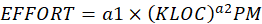

# Manual

<h2 align="center">Practical–1</h2>

<h3 align="center">Project Title: Attendance Management System</h3>

Definition:

Attendance Management System keeps track of student attendance in an academic environment. It is a web-based system used to record, manage, and monitor lecture-wise attendance of students. Attendance is marked according to the predefined timetable and stored digitally for future reference.

The system replaces the traditional manual attendance register and provides a computerized way of recording attendance for a single division.

***

Information:

Attendance management is the process of maintaining records of student presence in academic lectures. Traditionally, attendance is recorded manually in registers. In this proposed system, attendance is recorded electronically and stored in a centralized database.

Attendance is marked per lecture based on timetable slots. The system ensures that attendance percentage is calculated automatically. The system also helps in minimizing errors, reducing paperwork, and providing quick access to attendance reports.

Attendance management takes place in educational institutions such as schools and universities to ensure proper academic monitoring.

***

Objectives:

* It facilitates access to attendance information of a particular student.
* It helps in evaluating attendance eligibility criteria of students.
* It provides lecture-wise attendance marking based on timetable.
* It automatically calculates attendance percentage.
* It reduces manual errors in attendance recording.

***

Purpose:

The purpose of developing the Attendance Management System is to computerize the traditional method of taking attendance and to provide a structured and efficient way of maintaining student attendance records.

***

Functions:

i. Administrator\
ii. User (Teacher & Student)

***

Administrator:

Administrator has the rights to manage student details, add a new student, update student information, assign subjects, and manage timetable details. The administrator can also view attendance reports and monitor attendance percentage of students. The administrator has full control over system data and management functions.

***

User:

There are two types of users:

a. Student:\
Student can login to the system and view personal profile information. Student can view attendance details and attendance percentage for different subjects and dates.

b. Teacher:\
Teacher can login to the system, view assigned timetable slots, and mark attendance for students. Teacher can update attendance status and view attendance records.

***

Features:

* Manage attendance of students in one place.
* Lecture-wise attendance marking based on timetable.
* Simple and easy interface for marking attendance.
* Automatic calculation of attendance percentage.
* Prevention of duplicate attendance entries.
* Generate cumulative attendance reports.
* Quick retrieval of attendance records for a specific period.
* Secure login system for Administrator, Teacher, and Student.

***

 

&#x20;

<h2 align="center">Practical – 2</h2>

Aim: Identify Suitable Design and Implementation model from the different Software Engineering models.

***

Spiral Model

In each phase of the Spiral Model, the features of the product are identified and analyzed, and the risks at that point in time are evaluated and resolved through prototyping and testing. Thus, this model is much more flexible compared to other SDLC models.

The Spiral Model is one of the most important Software Development Life Cycle (SDLC) models which provides strong support for risk handling. In its diagrammatic representation, it looks like a spiral with many loops. Each loop of the spiral is called a phase of the software development process.

The number of phases required to develop the product depends upon the size and complexity of the project. The project manager plays an important role in determining the number of cycles required. Each loop of the spiral includes:

* Planning
* Risk Analysis
* Engineering
* Evaluation

For the Attendance Management System, requirements such as timetable management, lecture-wise attendance marking, role-based access, and percentage calculation may evolve during development. Therefore, the Spiral Model is suitable.

\
&#x20;

&#x20;

 

***

Justification for Choosing Spiral Model

* The Spiral Model combines iterative development with systematic risk analysis.
* It allows changes in requirements at different stages of development.
* Risk analysis helps in identifying issues related to data consistency, duplicate attendance entries, and unauthorized access.
* It is suitable for projects where requirements may evolve after discussion with users (admin, teacher, student).
* It supports prototyping, which helps in designing user-friendly dashboards and attendance modules.

Since the Attendance Management System involves database design, authentication, attendance calculation logic, and role management, the Spiral Model ensures flexibility and controlled development.

***

Justification for not Choosing Waterfall Model

* Once the system enters the testing stage, it is difficult to make changes in requirements.
* Requirements of attendance calculation and timetable logic may need modification during development.
* Waterfall model is not suitable where requirement clarification is needed after development begins.
* It does not support risk handling efficiently.

***

Justification for not Choosing Incremental Model

* It requires complete system planning before dividing into increments.
* Integration issues may arise between attendance module and timetable module.
* Total cost may increase due to repeated integration and testing phases.

***

Justification for not Choosing Prototype Model

* Continuous changes in requirements may increase cost.
* Excessive prototyping may delay final system delivery.
* Documentation may become weak due to frequent modifications.

***

Justification why Spiral Model is better than other models

* Risk analysis is performed in every phase.
* Flexible and adaptive to requirement changes.
* Allows refinement of attendance logic and percentage calculation during development.
* Suitable for web-based systems with authentication and database integration.
* Provides better control over system development.

***

 

&#x20;

<h2 align="center">Practical–3</h2>

Aim:

Study Software Requirement Engineering. Student should include SRS document for current semester project.

***

SRS (Software Requirement Specification)

***

ASSUMPTION:

1. Users (Admin, Teacher, Student) are already registered by the Administrator.
2. The system is designed for a single division only.
3. Timetable is predefined and stored in the system.
4. Each subject is assigned to one faculty member.
5. Attendance is marked lecture-wise according to timetable slots.

***

Requirement 1: Registration

Req1.1: Enter the details of user (as Admin)

Input: Details of user (External)\
Output: Save the details in system (Internally)

Req1.2: Register students and teachers done by Admin

Input: Enter the details of students and teachers by Admin\
Output: Store user information in database

***

Requirement 2: Login System

Req2.1: User Authentication

Input: User ID and Password (Internal)\
Output: Successful login and redirect to respective dashboard

Req2.2: Invalid Login Handling

Input: Incorrect credentials\
Output: Error message and access denied

***

Requirement 3: Show Information of Admin

Req3.1: Admin Information

Input: Admin ID and Password\
Output: Admin profile details

Req3.2: System Management

Input: Admin commands\
Output: Manage students, faculty, subjects, timetable

***

Requirement 4: Show Information of User

Req4.1: Student Information

Input: Student ID and Password\
Output: Student profile details and attendance records

Req4.2: Teacher Information

Input: Teacher ID and Password\
Output: Teacher profile and assigned timetable slots

***

Requirement 5: Attendance Management

Req5.1: Marking Daily Attendance

Input: Student ID, Timetable Slot, Date, Status (Present/Absent/Pending)\
Output: Attendance stored successfully

Req5.2: Prevent Duplicate Attendance

Input: Same student, same slot, same date\
Output: Duplicate entry prevented

Req5.3: View Attendance

Input: Date or timetable slot\
Output: Attendance list of students

***

Requirement 6: Attendance Percentage Calculation

Input: Attendance records within selected date range\
Output: Attendance percentage

Formula:

Attendance % =\
(Total Present Lectures / Total Conducted Lectures) × 100

Total Conducted Lectures include:

* Present
* Absent
* Pending
* No Attendance (no record exists)

***

Requirement 7: Role Management

* Admin can manage full system.
* Teacher can mark and update attendance only for assigned subjects.
* Student can only view attendance.

***

Requirement 8: Data Security

* Users are not allowed to access unauthorized modules.
* Students cannot modify attendance.
* Only authorized teacher can update attendance for their subject.

***

Requirement 9: Modification of Personal Information

Req9.1: Update Personal Details

Input: Updated information (External)\
Output: Updated status message

Req9.2: Save Changes

Input: Modified details\
Output: Updated successfully in database

***

SOFTWARE QUALITY ATTRIBUTES

Accuracy:

The system ensures accurate attendance recording and percentage calculation.

Reliability:

Attendance data is stored in structured database ensuring reliability.

No Redundancy:

Duplicate attendance entries are prevented.

Immediate Retrieval of Information:

Attendance records can be accessed instantly by authorized users.

Easy to Operate:

The system is web-based with simple user interface and easy navigation.

***

3\) External Interfaces

***

3.1) Hardware Interfaces

All components of the system can be executed on a Personal Computer or Laptop with internet connectivity.

Minimum Hardware Requirements:

* Hard Disk – 256 GB or above
* RAM – 4 GB or above
* Processor – Intel Core i3 or above
* Internet Connection (Wi-Fi or LAN)

The system does not require any special hardware devices such as biometric scanners or RFID systems.

***

3.2) Software Interfaces

The system is a web-based application and will run on modern web browsers.

Software Requirements:

* Operating System: Windows 10 or above / Linux / macOS
* Web Browser: Google Chrome, Mozilla Firefox, Microsoft Edge
* Backend Technology: Node.js with Express
* Database: MySQL
* Frontend: HTML, CSS, JavaScript
* Server Environment: Localhost or Web Server

The application communicates with the database for storing and retrieving attendance data.

***

3.3) Communication Protocols and Interfaces

* The system uses HTTP/HTTPS protocol.
* Communication between client and server occurs over TCP/IP.
* REST APIs are used for data exchange.
* Authentication is handled using secure login mechanisms.

The system supports access from any device connected to the internet with a compatible browser.

***

3.4) User Interface

* The system provides a responsive web interface.
* Dashboard for Admin, Teacher, and Student is provided separately.
* Teacher can select timetable slot and mark attendance using dropdown options.
* Student can view attendance percentage and attendance history.
* The user interface should respond within 3–5 seconds.

The interface is designed to be simple, user-friendly, and easy to operate.

***

 

&#x20;

<h2 align="center">Practical–4</h2>

Aim: Study Software Project Management Planning. Student should write SPMP document for current semester project.

***

SPMP (Software Project Management Plan)

Software Project Management Planning involves organizing, scheduling, monitoring, and controlling software development activities to ensure the successful completion of the project within time and budget.

The Attendance Management System project is planned using structured scheduling and management techniques.

***

1\) Scheduling in Project Management

Scheduling is the listing of activities, deliverables, and milestones within a project. It defines how tasks will be executed and completed within the planned timeline.

***

2\) Seven Principles of Software Scheduling

1. Compartmentalization –\
   The project must be divided into manageable tasks. For the Attendance Management System, tasks include requirement gathering, database design, API development, frontend development, testing, and deployment.
2. Interdependency –\
   Some tasks must be completed before others. For example, database design must be completed before backend development, and backend APIs must be ready before frontend integration.
3. Time Allocation –\
   Each task is assigned a specific time duration.
4. Effort Validation –\
   Ensure that assigned tasks do not exceed the available team capacity.
5. Defined Responsibilities –\
   Each task is assigned to a specific team member.
6. Defined Outcomes –\
   Each task must produce a measurable output such as SRS document, working module, or test report.
7. Defined Milestones –\
   Major checkpoints such as completion of SRS, completion of coding, and final testing are defined.

***

3\) Project Development Phases

The Attendance Management System will be developed in the following phases:

1. Requirement Analysis
2. System Design
3. Database Design
4. Backend Development
5. Frontend Development
6. Integration and Testing
7. Deployment
8. Maintenance

***

4\) Project Schedule (Tentative Timeline)

<table data-header-hidden><thead><tr><th valign="top"></th><th valign="top"></th></tr></thead><tbody><tr><td valign="top">Phase</td><td valign="top">Duration</td></tr><tr><td valign="top">Requirement Analysis</td><td valign="top">1 Week</td></tr><tr><td valign="top">System &#x26; Database Design</td><td valign="top">1 Week</td></tr><tr><td valign="top">Backend Development</td><td valign="top">2 Weeks</td></tr><tr><td valign="top">Frontend Development</td><td valign="top">2 Weeks</td></tr><tr><td valign="top">Integration &#x26; Testing</td><td valign="top">1 Week</td></tr><tr><td valign="top">Deployment &#x26; Documentation</td><td valign="top">1 Week</td></tr></tbody></table>

Total Estimated Duration: 8 Weeks

***

5\) Project Scheduling Methods

Two project scheduling methods applicable:

(i) Program Evaluation and Review Technique (PERT)

PERT helps in:

* Identifying task dependencies
* Estimating task duration
* Determining critical path

(ii) Critical Path Method (CPM)

CPM helps in:

* Identifying the sequence of critical tasks
* Determining minimum project completion time

These methods ensure that delays in one phase do not affect overall project completion.

***

6\) Gantt Chart

A Gantt chart is used to visually represent project tasks against time.

It shows:

* List of project activities
* Start and end dates
* Duration of each activity
* Overlapping tasks
* Overall project timeline

The Gantt chart helps in tracking project progress and ensuring timely completion.

***

7\) Resource Allocation

Human Resources:

* 1 Project Developer
* 1 Tester
* 1 Database Designer

Technical Resources:

* Computer system
* Internet connection
* Development tools (Node.js, MySQL, Code Editor)

***

8\) Risk Management Plan

Possible risks:

* Requirement changes
* Database design errors
* Unauthorized access issues
* Delays in development

Mitigation strategies:

* Regular review meetings
* Testing at every stage
* Backup of database
* Secure authentication implementation

***

9\) Deliverables

* SRS Document
* System Design Diagrams
* Source Code
* Test Cases
* Final Project Report

 

&#x20;

<h2 align="center">Practical–5</h2>

Aim: Do Cost and Effort Estimation using Software Cost Estimation Model.

***

Objectives:

To make use of COCOMO model to find out the cost of software development.

***

Organic Mode

A development project can be considered of organic type if:

* The project is relatively small.
* The team size is small.
* The project is well understood.
* The development team has experience in similar projects.

The Attendance Management System is considered as an Organic type project because it is a small-scale web-based application for a single division.

***

COCOMO (Constructive Cost Estimation Model)

COCOMO was proposed by Barry Boehm.

According to Boehm, software cost estimation is done in three stages:

* Basic COCOMO
* Intermediate COCOMO
* Complete COCOMO

For this project, we use Basic COCOMO Model.

***

Basic COCOMO Model

The estimation model is given by:

\
.png>) 

Where:

* KLOC = Estimated size of software in thousands of lines of code
* a1, a2, b1, b2 = Constants
* Effort = Person Months (PM)
* Tdev = Development time in months

For Organic mode:

* a1 = 2.4
* a2 = 1.05
* b1 = 2.5
* b2 = 0.38

***

Function Point Estimation

Requirements Analysis:

External Inputs (EI) = 6\
(Login, Add Student, Add Faculty, Add Subject, Add Timetable, Mark Attendance)

External Outputs (EO) = 4\
(View Attendance, Attendance Report, Percentage Report, Dashboard)

External Inquiries (EQ) = 3\
(Check Attendance, View Timetable, Search Student)

Internal Logical Files (ILF) = 3\
(Student Table, Faculty Table, Attendance Table)

External Interface Files (EIF) = 1\
(Database Interface)

***

Calculation:

EI = 6 × 4 = 24\
EO = 4 × 5 = 20\
EQ = 3 × 4 = 12\
ILF = 3 × 10 = 30\
EIF = 1 × 7 = 7

Total Count =\
24 + 20 + 12 + 30 + 7 = 93

***

Value Adjustment Factors (VAF)

F1: Reliable backup & recovery – 4\
F2: Data communications required – 4\
F3: Distributed processing – 1\
F4: Performance critical – 3\
F5: Heavily utilized environment – 1\
F6: Online data entry – 4\
F7: Multiple screen input – 3\
F8: Online updates – 4\
F9: Complex inputs/outputs – 2\
F10: Internal processing complexity – 2\
F11: Reusability – 2\
F12: Conversion and installation – 1\
F13: Multiple installations – 1\
F14: Ease of use – 4

Sum of Fi = 36

***

Function Point Calculation

.png>)\
.png>)\
.png>)\
![](data:image/png;base64,iVBORw0KGgoAAAANSUhEUgAAAJcAAAAXCAMAAAAx8S2TAAAAAXNSR0IArs4c6QAAAJZQTFRFAAAAAAAAAAA6AABmADo6ADpmADqQAGa2OgAAOgA6OjoAOjo6OjpmOmaQOma2OpC2OpDbZgAAZgA6ZjoAZjpmZpC2ZpDbZrbbZrb/kDoAkDo6kGY6kGZmkLbbkNv/tmYAtmY6tpA6tpBmttvbttv/tv//25A625Bm27Zm27aQ29u22////7Zm/9uQ/9u2/9vb//+2///bgA4BawAAAAF0Uk5TAEDm2GYAAAAJcEhZcwAAEnQAABJ0Ad5mH3gAAAAZdEVYdFNvZnR3YXJlAE1pY3Jvc29mdCBPZmZpY2V/7TVxAAAB+klEQVRIS+1U2VaDMBAltCrWWlurrYiKrRrbUpb8/8+ZmUlgwnLM8ckH5gEGZsnNnSUIRhkZGBn4RwxUK0FymQVGn2498RVJJMQiA+8TqLeffoFFcsUcD3WSIGCWfKURaUjginoRiyev/DomC/IIwqW4y4ID3O13KRIhGC4ZboNjhD8cS07/UsCSR0v9PAt4/i7p5Es7SbiFRERp+Mai1Iv5qhU05vMPIoGE9BSSuJYzY4d0T1wmu7kX3s3FZT5VfAH4mXBc7pHMIlkyiQy46Qd5Mzkq7ANkgpivRWEiFWPSIVx0mA1tcKkYWuoeKVexTlwmrTJKMxjwWvJjIRJSEq5yf71pnQ/AemCZ2pGzxUVJGlw0g/Yv6PPXQYpcAzb7aU1NnAoRPrbbXgObTbpDyutIuCzpjQWbSRIPvNV8sH1HIlwccVaA7V13HvWte2bbB5fTXk7f+iDTPjiPpiZtECoO1z05HVwY0+kvXn5sta4M9ZdhiQXJVmdqWLq/usA4LrqWXQG1pbtKPGmybpSX9hejDgtr57HdYfxQYspWrbZItnq57omufA+xijgCRzOZJpZg9S0KM8LVCjZIKra6jAsKssN91vNnlw7X/WCpeGpGsNzPhLAfFtez2ffVAydMJdpViJuNHkLApXZ6enDDNBa/40evkYG/MfADjIgxOE8StPMAAAAASUVORK5CYII=)\
![](data:image/png;base64,iVBORw0KGgoAAAANSUhEUgAAAMMAAAAXCAMAAACBDguhAAAAAXNSR0IArs4c6QAAAIpQTFRFAAAAAAAAAAA6AABmADo6ADpmADqQAGa2OgAAOgA6OjoAOjpmOmaQOma2OpC2OpDbZgAAZgA6ZjoAZpC2ZpDbZrbbZrb/kDoAkDo6kGY6kLbbkNv/tmYAtmY6tpA6tpBmttv/tv//25A625Bm27Zm27aQ29u22////7Zm/9uQ/9u2/9vb//+2///bRsUOhAAAAAF0Uk5TAEDm2GYAAAAJcEhZcwAAEnQAABJ0Ad5mH3gAAAAZdEVYdFNvZnR3YXJlAE1pY3Jvc29mdCBPZmZpY2V/7TVxAAACJUlEQVRYR+1Va1fCMAxtB8oU0YnCRIdABfZg+/9/zyZptxYWN45f9Jz1w+hOHru5uQlCDGdgYGBgYODPMVBGks5tKsx9vOiJsliFUs5S8D7C9WFrA3lLR2onUHtWsUZlzw9I8wj8ymiiffFexHLZqwgdk4o8hHAlH1OxBx7w8JaOxE4geKo6I7zxSPMQ0IsEcOfhk35mEp7dJxnt8Ds6UiH6JPigKN7SkdUJBCCjudMHjY5Dmjms071nDdQ6mxmhmxp4iy2hWsmbd3w5NGKxarApy2jhaknjavThI1WWPOAUma3p/Jk0g7RELXrV8Babcb0Qe+x5PoUv2uMHJhNvHgSLFN2KZxRBFWtmT6szKSkz9PDjisx8gAZCx23uXg0W3mIc8hk2cJZWb97oeYHZaOfVwCOlaScYdJ9Sk7sPDvJxLkmlUgYvVhe8xXRsC7/FSgZnK9AJLKNl215qQ4riV8SvK7juEoT4CmUwO6AmoIufzRbhLca3fR7clImmBqhXtlM8Uk9kzmj0qQF9cC/RSfylzFsEMw8mDwRmtYJtehZpFeMYE5HeFqiL4ObhMki1zYsp1FvXGTMP5yldRDxSswkw2L1f2Qb6f3CIr9/aLKLYQv6WeTjrrFsDj1TRRJrY5t6zhtM6wFbjLB5gQ5URNfbScmVKUkajEhYpqM4Cd+/9vlfFY7OKTpt7KfGFamiz9MrZBKIwpLRF/A5pr28PTgMD/5+Bb99dQI5IF0/oAAAAAElFTkSuQmCC)

***

Convert FP to LOC

Assume:\
1 FP = 75 LOC

![](data:image/png;base64,iVBORw0KGgoAAAANSUhEUgAAAMUAAAAXCAMAAACMEHvmAAAAAXNSR0IArs4c6QAAAI1QTFRFAAAAAAAAAAA6AABmADo6ADpmADqQAGa2OgAAOjoAOjo6OmZmOmaQOma2OpC2OpDbZgAAZgA6ZjoAZjo6ZjpmZpC2ZpDbZrbbZrb/kDoAkDo6kGY6kGZmkNv/tmYAtmY6tpA6ttv/tv//25A625Bm27Zm27aQ29u22////7Zm/9uQ/9u2/9vb//+2///b0vPOWAAAAAF0Uk5TAEDm2GYAAAAJcEhZcwAAEnQAABJ0Ad5mH3gAAAAZdEVYdFNvZnR3YXJlAE1pY3Jvc29mdCBPZmZpY2V/7TVxAAACpElEQVRYR+1WyWLTMBCVHCBuIWDCkroFl9ZtGidY//95zCqNbJO69Ih1iTXSLO/NEjm3rIWBhYGFgbMMhOufr2boNTZON6X3m4PEEOp3+nkuqs7zWt27vtKvOTCMonOP6jmzEaVsD8/Ajaz9F++L77p7gp2/3OGl9cEdS4299bNQtIJizV4Yz5xlFF1b7Ny+BBOZjSQVe8dqdacc3/qPB/foP/Gedg/+yrmG3Lf4CatbbXMU4YdUSvygey3Z6T/DYV+x6ryVKSKABj0bG8CqShUFAaVFl12ombKW0GAQrATJoJ++2g0qKjQFwQj12zHZLSJ+GQqOhhQ7CqnDUIwNI5XQ6QYtidJxTLqjuCV8SkGzHvUFw1D4Sgr9su9/QMEqJhZjYxQhFJ4ODmFUNHVHHFP43Bjd6n7c3QhjEgQzCijeQ5N+yGeClj92jDKZGGBFjRc2xoaRskLyrd0basTVV6b2W+yQp62nPr1SVJZzgHER+8scHEtqiHCNDRfHQ5at6Y0ocrwUjLFhpKwt1QJfWlocfyo0vPVQ+mKzL4GxBpBgLtpBu8IUmmpgnguydDzMACEDRXJhKCUbIxRHDI1WHEFIedwZj3hBR7kfxAwJ3MbSTDrJOspyZs5iUUUeOKZHycZIOtEWpGjaQtylbpjoC6hCrsR8ZakYojjXF6rI1Br49DmS8vUO6Je4pT3GKFI9/H1G6T+PYImp4FadX1FRkbNAVBsbRkqeuOJCHQEqo+wx1Frsv2+LWPfDaZT+LwZ/zjEVNB5e0N0ph43fQUFtiINkI0kJBYEOv2Qq3bmTVjel5KRFEuo33+KYzB8tiFVfef3XLBlpcpxuLrw3Jp7p76QIscFgoTeRtZGkdLKNDzbY4CMqPvno6DJun/G7HC8M/G8M/AFSRkg3MFwRtQAAAABJRU5ErkJggg==)So, LOC ≈ 7050

KLOC = 7.05

***

COCOMO Effort Calculation

.png>)\
![](data:image/png;base64,iVBORw0KGgoAAAANSUhEUgAAAM4AAAAXCAMAAAB08IARAAAAAXNSR0IArs4c6QAAAJlQTFRFAAAAAAAAAAA6AABmADo6ADpmADqQAGa2OgAAOgA6OgBmOjoAOjpmOjqQOmZmOmaQOma2OpC2OpDbZgAAZgA6ZjoAZjo6ZjpmZpC2ZpDbZrbbZrb/kDoAkDo6kGY6kGZmkLbbkNv/tmYAtmY6tpA6tpBmttv/tv//25A627Zm27aQ29u22////7Zm/9uQ/9u2/9vb//+2///bGL6sWgAAAAF0Uk5TAEDm2GYAAAAJcEhZcwAAEnQAABJ0Ad5mH3gAAAAZdEVYdFNvZnR3YXJlAE1pY3Jvc29mdCBPZmZpY2V/7TVxAAAC4klEQVRYR+1WW3vaMAy1oRdYu42W0W3cuoW2M4w4xP//x83WxZEd0/K674tfELGs6BzpKFZqWAMDAwMDA/89A27zO8PQzjWu8R8V7ZtjYvsjhyetRz/hLHldLb1d0WGtHy/iptlOtL5/E75u7V/28aq7LGUSPmml/oagXymonYd4GBXtdn7rnaTtdvrhqPaUM+y4Sq+C51FVPqad5jQVM6y1998H5uIy+iI4huCEzASnIZLB3CiMnYCLCfSSXa0yO6QeIGMedsK+9lMoqQ8UjAtWDQEwGq56vEjhuGciJhrgB+mp9huz1s5jDAMBqhFu1TJ42SaUfARP8EP+lWjcVl//ggeHQicJOO18mTWbo7zc+rrPEGYOwDo4+IDhGIIFHJRtdqVfk3As6WBIu6XaYwnv+zlxkSGJ2552EI90ikQJDDkcJhXONU9QKQjdYEGFbSdIilsDWtg57Vj8jFVUx86gerOj23RtFfdN1wK++fqjIOApolFdcXx1vgT9U7FOr1McUzSnUBQ4szB3YdeUOaiEd3iSlCaThSnTbPUoTL9siWoGigvnPZ67sZx+FMFOOnLcJuifePbzdfQDkYGuaxwYkDeKTtpMp59LuLNSDQw/PM+WSPsd7dhpl1PljwY4Jquhp7JQVRih6YqFdi9UBVH6D6WDLwGBxRYrSUed145kmL8lOkveN/VCiJgR4EBNFveNf0jzRUCWDZvoFWOThLA7IgsF6ah6Bu4F7fQGUqHZgkRJpknu/eJgC+EyYJIe4LuBn09c0sbU+Q24w4GKmm3Oacet4fUvgubzky1TT1ocnAqQmTDpk4hSMKgNAiuh3byphuuPXkSDP1/4PCSkyj/cXuE+QULI+ei+O5lSuDh4Eq8CMArAPIDZLOjy4FGGdzEGaXuvcGGb4eigHbfWnz191k/Liy4pCIqveB2cMECTvOOtsv2elCe2C8JptndaX8E4O71G8yyPw8bAwMDAewz8A0OGV8HtkyFDAAAAAElFTkSuQmCC)\
![](data:image/png;base64,iVBORw0KGgoAAAANSUhEUgAAAMEAAAAXCAMAAACF+9ucAAAAAXNSR0IArs4c6QAAAJNQTFRFAAAAAAAAAAA6AABmADo6ADpmADqQAGa2OgAAOgA6OgBmOjoAOjo6OjpmOjqQOmaQOma2OpC2OpDbZgAAZgA6ZjoAZjo6ZmYAZpDbZrbbZrb/kDoAkDo6kGY6kLbbkNv/tmYAtmY6tpA6ttvbttv/tv//25A627Zm27aQ29uQ2////7Zm/9uQ/9u2/9vb//+2///bkimH4QAAAAF0Uk5TAEDm2GYAAAAJcEhZcwAAEnQAABJ0Ad5mH3gAAAAZdEVYdFNvZnR3YXJlAE1pY3Jvc29mdCBPZmZpY2V/7TVxAAADCUlEQVRYR+1Wa3cSMRBNaqFrFaWsVCliF60L7qOb///rnLkzkwSUx0ePZ3NOy0Aec++dR+LcOEYFRgVGBf4JBYbSy3jz00V72hzYBHT/6P3NFyDWVbcrsivd7P3iSjb95k5W9hvaO3uO23aF9/OGvrYJkEzmDtmWA8iavMDqSsLrwpr/iz2UvCa3w9Y/NG6nMDETKv/EKxtXEffubYJyjgrDFgBdMX1x/ZoOkVHfrNy+4LlaGShTg6Jru9IzRoineztsczWLqHbFU7nNaJklYcWMre3uOXB0IhtXjG72Q+QhADfMWZ2YavADJG74lDQRhy0E7O4/gwF9ChqeMBlO2uZHvOoO+zGCyBiEjZ98w/c99MqGMlA1jI+eKSAxalE6gyiT7ZRjTmo+IF+wVGCdsxW56uZqkJe4HLK2c7Yrt5NAzY5jcxiDoVTIRyGhyCZdzSGAVgsArqe/4IAGxOgfwQLF0Ev4MptSFmzDGmdg5nVrchm9KAPhnjP4Yt6ErxkOWWAMUAehMh2NQdQ1C0FYU+K9buAwrJ84aajuassdKXRJKbFlb2ZbbJHxNvNR+oC2gAw+g8ccVS1V5/GIedMvyZd2EysL9cD0M+oCZYa0JOhUFWG9QAPBQJW0Ul2AKoWU28a2lTbCGvRaj1kt5lAv14EbltTGeokqDYlBZBDhmUM7vZ02lHlUJHEp9a7E9kRJxDKQpVgVcydvBJHENXUACRNknJ26Q3695LCqO4r6LfVu6U8gb8FI3ZJ/ts6Z9OEOzkkkN0ck/pcycO0caM7VwVDCb3Qj51m+HoRAHMqgMqA/TpWonIqAfh5TFOKkC0VO1zrWGfOVM40h6C/XgZ6WJT4uM0mqpC9/y6Hg5kT5R+VksaR1rdclb8ttckPX51JTVmbMdVdMrrrLIjtrbK1HL8LFzuGo/IrDdpwXx7CsbvpSLTQEHqQyv0dM+NwmgvwowpslrqJQfiClO3rMZH0v4jxhhM07dvaeH1j80vIzOkMYhO9Fenil+P8BK3XNlP6X3I7zowL/uQK/AbzKWIPvpd9xAAAAAElFTkSuQmCC)

***

Development Time

.png>)\
![](data:image/png;base64,iVBORw0KGgoAAAANSUhEUgAAAK8AAAAXCAMAAABK1e9fAAAAAXNSR0IArs4c6QAAAK5QTFRFAAAAAAAAAAA6AABmADo6ADpmADqQAGa2OgAAOgA6OgBmOjoAOjo6OjpmOjqQOmZmOmaQOma2OpC2OpDbZgAAZjoAZjo6ZjpmZjqQZmaQZpC2ZpDbZrbbZrb/kDoAkDo6kGYAkGY6kGZmkLbbkNvbkNv/tmYAtmY6tpA6tpBmtrZmttv/tv//25A627Zm27aQ29u229vb2//b2////7Zm/9uQ/9u2/9vb//+2///bheCyxQAAAAF0Uk5TAEDm2GYAAAAJcEhZcwAAEnQAABJ0Ad5mH3gAAAAZdEVYdFNvZnR3YXJlAE1pY3Jvc29mdCBPZmZpY2V/7TVxAAACoklEQVRYR+1W3ZrSMBDNlIUtruuKUn+hWNTCCgVdmi55/xdzMpOkSVrWVff79ILcENrMycmZM5MKcR5nBc4K/EsFZAqjw9MSUIuvTwVYgh2vLaRM3fQPdmmKFOB6YyKPU4IfbB+BFEbqAHxyqX+/a8yXGvM4vTyIEuHk2Ekg0/kj0E8sqQEBd47gb/CNIoVQq2RGia7glcbUWZfPtsgZZ3piRp38RfZqkrIEc+TjtHt2tTT4bkIbR5FC5UNDqSJ/lpaWZNHd4Ne/GKqA4Wdas+9Z/TBfs3NLyNvLRYoqks3xra0YaJg3ADcZ01erFJKP+GwB+GCfJYFSq5nYkc/lddebKreG7dNXKNq6XeTR9SNDFVtVHXFRp2i+CqjcZDraqE+DbfPuLh8d5OQu96tQTmjJ5KAWPWavnALH6Y0ulSgFmnAvXdzcwtUwM4JpNve3Y5SOdUQ6PCMjC7Yvz3UlmgUq94lJagBNAcmsaxwvYWqhSyWNHYaErwa2h3gAXmQJwy9CrZk/drHkg2HZCs2HqyiX2j0/VvQAe4gW80Ug0gP+leNY8lY1yw37Rk9e/EjOOsumVV3bW8GdiTPEcqscu+bz9yQB9+NViH/avz3tsGaLtUPlSdbtQkEk8/VcYyvR2ZfPwuxYUx50oFobth30t9e/fRUW80W66N+YcBhp+TormbryKxLfqYJuC+arltYakRtEc8q/istybQTl3hj5wfWHwMFRJJ+ReAQgMrVtGZlv1PIbzPcoXonl0GS0K1p5F1d4mF5feHO9z3ErtBdfTWG9Md1OQ6vDSNKflxLInkHw68Z93sgML+ljBhNt4ALshVDDRU8TOMHYfo8Yvk1xBXBhS5tj3NfP8a0vcBSJ/R8PQB8N97ddkJOCnV+cFfhvFfgJuEFUW6XOaX4AAAAASUVORK5CYII=)\
![](data:image/png;base64,iVBORw0KGgoAAAANSUhEUgAAAL0AAAAXCAMAAABpjr6KAAAAAXNSR0IArs4c6QAAALpQTFRFAAAAAAAAAAA6AABmADo6ADpmADqQAGa2OgAAOgA6OgBmOjoAOjo6OjpmOjqQOmZmOmaQOma2OpC2OpDbZgAAZgA6ZjoAZjo6ZjqQZmYAZmaQZpC2ZpDbZrbbZrb/kDoAkDo6kDpmkGYAkGY6kGZmkJBmkLbbkLb/kNvbkNv/tmYAtmY6tpA6tpBmtrZmttv/tv//25A625Bm27Zm27aQ29uQ29vb2//b2////7Zm/9uQ/9u2//+2///b5DeTpQAAAAF0Uk5TAEDm2GYAAAAJcEhZcwAAEnQAABJ0Ad5mH3gAAAAZdEVYdFNvZnR3YXJlAE1pY3Jvc29mdCBPZmZpY2V/7TVxAAADSklEQVRYR+1Wa3fTMAy1s7Yz47F1Cx0D2hQ6HksYbVhhiR3//7+FLMmO3VI6zvgA59Rf6iaydHV1JUeIwzowcGDg/2dAKzlq/m4adn7zaIe1lBdbTkrpV3in1bbZHwU3C3XMB7oc3R+thGg5kNu75V6RGeyGy70RvsnZpk2XHzeiBIf6SaBHqy2zva4jA1tl01C7CD2Qh8snJnTORQYGHxCx9mn3sfTJClIHpbgNrzZ7TJ1tMQyeHK0BV40V7V72LJ1coUT1ydU2sB5iyy/LX+tZhzrTkfohsrcLOfyI5uu0Seok9wj9lvN25IoubHHu6Nu1DL+0RShaYtr2dTOXUp5OyMxWSmZvhTBzV+z1JEuqW03FHfaHfh5R7chOgmyij/+XF5hpPfrOjWYWUmZTiHyrshtbyewTpIZqg0CgZz0hqcErKQfEnSgDW62CLqipt7UaLe37o5V5dV+MGj2+L+Je1mM0GTd2nkq2lVPOGn13+amS8ixQG9XVFjPHGzRcTfRx9Jmop1pNr5eoaGh2CtBmH8YN/SmPlmLNGVsAR2mwOSZDey6t20KwqGIaZwSQ5biKVymHn4X94stp5+cNFMlHiAcCwIbpZoEUjMIRaeBpBRWlMvpmLSUQhujpeUX908ueOCBzV9QfFT4ga/0i0eYu3VMhKfewmFxmgx+3o6bLL6AYbExGhB73uPXc2sLBQqnZImqtIHsyIHPU27PXyDA5rFKF7NI9oSdXYbV80SQ3SXkMZgMY1PyUKuC1AXucfZAgukEKORUzkWNPTpA9cUC+4uZDh60TeoRnl+49+oR7j54A0nJKBI4gGAFmZHie5gtaB9n3msG2Zk89TYjeLvCuIvT22kVz5drQjTC7dE9AQ/LUpaychHq8HnGGxwmTjFkzKHtWCf5iKgjFJ6WVv10gj6W9/ipnayDW9bWZYNXg4F0/NZISbP9BUVoHqMuBn1pGXRtTH2AJkxNAd8ZMEIxvTvNuBYnbW4BBhchu1mOYajAW6Ax8k4WPMpinZ8uORAVd6a+jVg42BsvvMsBhfAalQfRm8RRG8xtUaXIVwFcPFd99S+DOHcxIz5Rm5b5+AI57yJNDATZ9CZCHj/kc2FOAw+sDA/80Az8BQalzpUBc/gwAAAAASUVORK5CYII=)

***

Final Estimation

Effort Required ≈ 18 Person Months\
Development Time ≈ 6–7 Months

If salary of developer = ₹15,000 per month

Total Cost =\
18 × 15,000

Total Cost ≈ ₹2,70,000

 

&#x20;

<h2 align="center">Practical–6</h2>

Aim: Prepare System Analysis and System Design of identified Requirement specification using structure design as DFD with data dictionary and Structure chart for the specific module.

***

Level–0 DFD (Context Diagram)

This reflects real system interaction.

&#x20;

&#x20;

&#x20;

&#x20;

&#x20;

&#x20;

&#x20;

 

✔ Clean\
✔ Role-based\
✔ Single division\
✔ No unnecessary parent/payroll modules

***

Level–1 DFD (Properly Structured)

This breaks system into actual working modules.

&#x20;

✔ Master Data = Students + Faculty + Subjects + Timetable\
✔ Attendance tied to timetable\
✔ Clear separation of modules

***

ER Diagram (Correct Database Representation)

This is the most important and must match your actual schema.

\
&#x20;

 

✔ Attendance linked to timetable\
✔ Timetable linked to subject + faculty\
✔ Single division (no class table needed)

This matches your real project design.

***

Structure Chart (Modular Architecture)                          &#x20;

&#x20;

&#x20;

&#x20;

&#x20;

&#x20;

&#x20;

&#x20;

&#x20;

 

✔ Clean module separation\
✔ Duplicate prevention included\
✔ Percentage calculation module present

***

🔹 5️⃣ Attendance Percentage Logic (Strict Rule Version)

This matches your rule:

* Present counts
* Absent counts
* Pending counts
* No Attendance counts
* Only Present increases %

***

 

<h2 align="center">Practical–7</h2>

Aim:

Designing the module using Object Oriented approach including Use Case Diagram with scenarios, Class Diagram, State Diagram, Sequence Diagram and Activity Diagram.

***

Use Case Diagram

A Use Case Diagram represents the interaction between users and the Attendance Management System.

Actors:

* Administrator
* Teacher
* Student

The diagram below represents the use cases of the system.

&#x20;

***

Class Diagram

A Class Diagram describes the static structure of the system including classes, attributes, methods, and relationships.

Main classes:

* Student
* Faculty
* Subject
* Timetable
* Attendance

***

State Diagram

A State Diagram shows different states of the Attendance entity and transitions between them.

States:

* No Attendance
* Present
* Absent
* Pending

***

Sequence Diagram

A Sequence Diagram shows the interaction between Teacher, System, and Database while marking attendance.

***

Activity Diagram

An Activity Diagram represents the workflow for attendance percentage calculation.

Attendance Percentage Formula:

Attendance % =\
(Total Present Lectures / Total Conducted Lectures) × 100

Total Conducted Lectures include:

* Present
* Absent
* Pending
* No Attendance

***

\
&#x20;

 

<h2 align="center">Practical–8</h2>

Aim:

Defining Coding Standards and walk through.

***

Coding Standard:

Coding conventions are a set of guidelines for a specific programming language that recommend programming style, practices, and methods for each aspect of a program written in that language. These conventions usually cover file organization, indentation, comments, declarations, statements, white space, naming conventions, programming practices, programming principles, programming rules of thumb, architectural best practices, etc.

These are guidelines for software structural quality. Software programmers are highly recommended to follow the Software Engineering guidelines to help improve the readability of the source code and make software maintenance easier.

Coding conventions are only applicable to the human maintainers and peer reviewers of a software project. Conventions may be formalized in a documented set of rules that an entire team follows.

In Attendance Management System, coding standards are followed to ensure accuracy in attendance marking, secure authentication, structured database handling, and reliable percentage calculation.

***

Why Are Coding Standards Important?

There are several reasons why coding standards are important:

1. Compliance with industry standards.
2. Consistent code quality no matter who writes the code.
3. Software security from the start.
4. Reduced development costs and accelerated time to market.

Coding standards help prevent defects in modules such as:

* Attendance percentage calculation
* Timetable management
* Role-based access control
* Duplicate attendance prevention

Without proper coding conventions, the project may result in:

* Reduced engineer motivation
* Increased development time
* Complex code base structure
* Difficult debugging and maintenance

***

Common Aspects of Coding Standard:

Naming Conventions:

Naming conventions define how packages, classes, methods, and variables should be named.

For Attendance Management System:

* Class names: Pascal Case\
  Example: AttendanceManager
* Method names: camelCase\
  Example: calculatePercentage()
* Local variables: camelCase starting with small letter\
  Example: attendanceDate
* Global variables: start with capital letter
* Constants: capital letters only\
  Example: MAX\_ATTENDANCE\_LIMIT

Meaningful and understandable variable names help anyone understand the reason for using it.

***

File and Folder Naming and Organization:

The file and folder structure should be organized properly.

Example:

* models/
* controllers/
* routes/
* config/
* middleware/

Each module should have a standard header format including:

* Name of module
* Date of module creation
* Author of the module
* Modification history
* Global variables accessed

***

Formatting and Indentation:

Code should be written in standardized format and indentation.

* All braces should start from a new line.
* Code after closing braces should start from a new line.
* Consistent spacing should be maintained.

This improves readability and reduces confusion.

***

Commenting and Documenting:

Proper comments must be added for:

* Complex attendance logic
* Percentage calculation formula
* Database queries
* Role validation logic

Documentation helps in understanding system behavior during maintenance.

***

Classes and Functions:

* Each function should perform a single task.
* Avoid long and complex functions.
* Use modular design.
* Avoid excessive global variables.

For example:

* markAttendance() handles attendance storage.
* calculatePercentage() handles percentage computation.

***

Testing:

Testing should ensure:

* Login validation works correctly.
* Attendance cannot be marked twice for same slot.
* Only authorized faculty can mark attendance.
* Percentage is calculated correctly.

***

Error Return Values and Exception Handling Conventions:

All functions that encounter error conditions should:

* Return proper error messages.
* Handle invalid inputs.
* Prevent system crashes.

Examples in Attendance Management System:

* Invalid login credentials.
* Attempt to mark duplicate attendance.
* Invalid attendance status value.

***

Google Code of Conduct:

1. Serve Users
2. Integrity
3. Usefulness
4. Privacy
5. Respect Each Other
6. Equal opportunity
7. Positive environment
8. Safe workplace
9. Avoid Conflicts of Interest
10. Preserve Confidentiality
11. Protect Organization Assets
12. Ensure Financial Integrity
13. Obey the Law

These ethical guidelines ensure professional behavior in software development.

***

What is Code Review?

Code review is a software quality assurance process in which source code is analyzed manually by a team or by using automated tools. The motive is to find bugs, resolve errors, and improve code quality.

Reviewing the code base ensures that every module of the Attendance Management System maintains proper structure and security.

***

Best Code Review Techniques:

1\. Instant Code Reviewing Technique

Developer writes code while reviewer checks simultaneously.

Advantages:

* Immediate feedback
* Quick bug detection

Disadvantages:

* Requires more workforce
* Interrupts workflow

***

2\. Ad-hoc (Synchronous) Code Reviewing Technique

Developer completes the code and then asks reviewer to review it informally.

Advantages:

* Simple and flexible

Disadvantages:

* May miss errors
* Interrupts working flow

***

3\. Meeting Based Code Reviewing Technique

Entire team reviews code together in a meeting.

Advantages:

* Knowledge sharing
* Collective discussion

Disadvantages:

* Time consuming
* Hard to conduct regularly

***

4\. Tool Based Code Reviewing Technique

Code is reviewed using tools such as version control systems.

Advantages:

* Structured review process
* Trackable changes
* Efficient for large code bases

For Attendance Management System, tool-based review is recommended for maintaining consistency and security.

***

 

&#x20;

<h2 align="center">Practical–9</h2>

Aim:

Write the test cases for the identified module.

***

The testing process cannot take place without prior communication with the programmers of the software. Testers must understand the working of the system before performing testing. Communication with developers and other testers helps to understand:

1. What to test?
2. What resources are required?
3. What will be the schedule of testing?

The software test plan is the principal way through which testers communicate their intent to the developers. The test case is the heart of the test plan.

A test case is a document that describes a set of data inputs and operating conditions required to run a test, together with the expected results.

If the obtained results match the expected results, then the test case status is said to be Pass.\
If the obtained results do not match the expected results, then the test case status is said to be Fail.

***

Test Cases for Attendance Management System

***

1\. LOGIN

Objective: To check whether only valid Administrator, Teacher, and Student can login using correct credentials.

Input: Valid username and password

Expected Output: User redirected to respective dashboard

Result: Pass

***

2\. INVALID LOGIN

Objective: To check system behavior when invalid credentials are entered.

Input: Incorrect username or password

Expected Output:\
Error message displayed and login denied

Result: Pass

***

3\. PREVIEW DASHBOARD

Objective: To check if Administrator, Teacher, and Student are redirected to their respective dashboards after login.

Input: Click Dashboard button

Expected Output: Respective dashboard displayed

Result: Pass

***

4\. ADD STUDENT

Objective: To check if Administrator can add a new student.

Input: Valid student details

Expected Output: Student successfully added to database

Result: Pass

***

5\. MANAGE TIMETABLE

Objective: To check whether Administrator can add and update timetable slots.

Input: Day, time, subject, faculty

Expected Output: Timetable saved successfully

Result: Pass

***

6\. MARK ATTENDANCE

Objective: To check whether Teacher can mark attendance for selected timetable slot.

Input: Student ID, timetable slot, date, status

Expected Output: Attendance record saved

Result: Pass

***

7\. PREVENT DUPLICATE ATTENDANCE

Objective: To check that duplicate attendance cannot be marked for same student, slot, and date.

Input: Same student, same slot, same date

Expected Output: Duplicate entry prevented and error message shown

Result: Pass

***

8\. UPDATE ATTENDANCE

Objective: To check whether Teacher can update attendance status.

Input: Modify status (Present/Absent/Pending)

Expected Output: Attendance updated successfully

Result: Pass

***

9\. VIEW ATTENDANCE

Objective: To check whether Student can view attendance records.

Input: Select date range or subject

Expected Output: Attendance details displayed

Result: Pass

***

10\. CALCULATE ATTENDANCE PERCENTAGE

Objective: To verify correctness of attendance percentage calculation.

Input: Attendance records

Expected Output:\
Percentage calculated using formula:

Attendance % = (Total Present Lectures / Total Conducted Lectures) × 100

Result: Pass

***

 

&#x20;

<h2 align="center">Practical 10</h2>

&#x20;

Aim: Demonstrate the use of different Testing Tools with comparison

1\. Testing Tools Overview

Selenium IDE:

Selenium IDE (Integrated Development Environment) is the simplest tool in the Selenium Suite. It is a Firefox add-on that creates tests very quickly through its record-and-playback functionality. This feature is similar to that of QTP. It is effortless to install and easy to learn. Because of its simplicity, Selenium IDE should only be used as a prototyping tool, not an overall solution for developing and maintaining complex test suites.

* Why it is Good?
* Large community.
* Simultaneous tests.
* Mobile support.
* Where’s the catch?
* Not beginner-friendly.
* No image verification.

TestComplete:

* Why it is Good?
* Ease of use.
* Customization.
* Timely updates.
* Support of desktop apps.
* Where’s the catch?
* No Mac support.

Katalon Studio:

* Why it is Good?
* Good for both pros and non-techies.
* Unified bundle.
* Abundance of tutorials.
* Visualized reports.
* Where’s the catch?
* Poor language support.
* Small (although growing) community.

Unified Functional Testing (UFT):

* Why it is Good?
* Automated tests from manual.
* Collaboration capabilities.
* Where’s the catch?
* Only one language supported.
* Price.
* Only Windows support.

Watir:

* Why it is Good?
* Choice of languages.
* Where’s the catch?
* May be too simple.
* Small community.

&#x20;

2\. Installation and Setup of Selenium

Installation of Selenium:

1. Download the setup from www.selenium.org.
2. Check the version of Chrome. Open Chrome Browser -> Help -> About Google Chrome.
3. Open Chromedriver.exe downloads where you will see the latest Chrome Driver for the latest google chrome version. Download the corresponding version.
4. Download the chromedriver.exe file for the respective OS and copy that .exe file into your local drive.
5. The path of the chrome driver (C:\webdriver\chromedriver.exe) will be used in our program.

Selenium Setup With Chrome Driver in Eclipse:

Now that we are done with setting up Chrome Driver, we will launch Eclipse for executing our Selenium codes.

1. Create A New Maven Project: Click on File -> New -> Others -> Maven Project.
2. Add the Group Id and Artifact Id. This will reflect in your pom.xml after clicking finish.
3. Configure pom.xml: Open the pom.xml file to add dependencies like Selenium, GitHub, TestNG, etc..
4. Project Build Path And Importing Jars: Download all Selenium jar files from the official Maven site. Right-click on your Maven Project -> Properties -> Java Build Path -> Libraries -> Add External JARs -> Apply and Close.

***

***

<h2 align="center">Practical–11</h2>

Aim:

Define security and quality aspects of the identified module.

***

Software Quality

Software Quality refers to how well a software product satisfies the requirements and expectations of the users. A high-quality software system is reliable, efficient, secure, and easy to use.

In Attendance Management System, quality ensures that attendance is recorded accurately, data is stored securely, and users can interact with the system easily.

***

Factors of Software Quality

***

1\) Portability

A software system is said to be portable if it can run on different platforms and environments.

***

2\) Usability

Usability refers to how easily users can interact with the system.

***

3\) Reusability

Reusability refers to the ability to reuse components of the system in other applications.

***

4\) Correctness

Correctness means that the system performs according to the specified requirements.

***

5\) Maintainability

Maintainability refers to how easily the system can be modified or updated.

***

6\) Reliability

Reliability means the system performs consistently without failure.

***

7\) Efficiency

Efficiency refers to optimal use of system resources.

***

Security Aspects

Security is an important aspect of any software system. The Attendance Management System must ensure that data is protected from unauthorized access and misuse.

***

1\) Authentication

* Users must login using valid credentials.
* Passwords should be securely stored (hashed).

***

2\) Authorization

* Admin, Teacher, and Student have different access rights.
* Students cannot modify attendance.
* Teachers can only mark attendance for assigned subjects.

***

3\) Data Validation

* All inputs must be validated.
* Invalid data should be rejected.

***

4\) Prevention of Unauthorized Access

* Secure routes and APIs.
* Session management or token-based authentication.

***

5\) Protection Against Common Attacks

* Prevent SQL Injection using parameterized queries.
* Prevent Cross-Site Scripting (XSS) by sanitizing inputs.
* Use secure communication (HTTPS).

***

Software Quality Management System

A Software Quality Management System ensures that the product meets the required quality standards.

***

Managerial Structure

The system must have proper management for maintaining quality throughout development.

***

Individual Responsibilities

Each team member must follow coding standards, testing procedures, and documentation practices.

***

Quality System Activities

1. Project auditing
2. Review of quality system
3. Development of guidelines and standards

***

Evolution of Quality Management System

Quality management evolves through the following steps:

1. Detect defects and correct them.
2. Improve product quality through testing and validation.
3. Ensure continuous improvement of processes.

***

&#x20;
